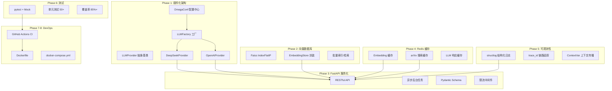

# Paper-Reviewer 项目增强方案 — 冲击大厂 SP

## 背景

当前 `paper-reviewer` 项目已经实现了完整的学术论文自动评审流水线（PDF解析 → 元数据提取 → 查询生成 → arXiv检索 → 相关度评分 → 摘要生成 → 评审报告）。但项目整体偏"应用脚本"风格，而非"工程化系统"：

| 短板 | 现状 |
|------|------|
| **架构** | 单一 Pipeline，`DeepSeekAPI` 硬编码为一个 provider |
| **性能** | 纯内存 cosine similarity，无缓存 |
| **工程化** | 无 pytest、无 CI/CD、无 Docker |
| **服务化** | 仅 CLI，无 API 层 |
| **可观测** | `print()` 调试，无结构化日志 |

> [!IMPORTANT]
> 本方案的目标是通过 **9 个增强阶段** 把项目从"CLI 工具"升级为"面试能讲深讲透的工程化 AI 平台"，覆盖 **架构设计、分布式、性能优化、微服务、可观测性、DevOps** 六大面试高频考察维度。

---

## User Review Required

> [!WARNING]
> 以下问题需要您确认：
> 1. **实现范围**：您希望一次性全部实现，还是分批次？建议按 Phase 1-9 顺序，每完成一个阶段我们验证后再继续。
> 2. **优先级排序**：如果时间有限，建议优先实现 Phase 1→3→6→7（架构+服务化+测试+CI），最能提升简历含金量。
> 3. **Redis 依赖**：Phase 4（缓存）需要 Redis 服务。您本地是否有 Redis 可用？如果没有，可以先用 `diskcache`（纯 Python 本地缓存）替代，后续再升级。
> 4. **Docker**：Phase 8 需要 Docker Desktop。您本地是否已安装？

---

## 项目增强全景图



---

## Proposed Changes

### Phase 1: 插件化 LLM Provider + 配置中心

> 重构核心 LLM 调用层，从"硬编码单一 provider"升级为"可扩展多 provider 架构"。这是所有后续阶段的基石。

#### [NEW] [llm_provider.py](file:///e:/Project/paper-reviewer/literature_review/providers/llm_provider.py)

定义 `LLMProvider` 抽象基类（ABC），声明 `chat()` / `chat_json()` / `simple_ask()` 等标准接口。

#### [NEW] [deepseek_provider.py](file:///e:/Project/paper-reviewer/literature_review/providers/deepseek_provider.py)

将现有 `deepseek_api.py` 的逻辑迁移到 `DeepSeekProvider(LLMProvider)` 实现类中。

#### [NEW] [openai_provider.py](file:///e:/Project/paper-reviewer/literature_review/providers/openai_provider.py)

实现 `OpenAIProvider(LLMProvider)`，通过 OpenAI SDK 支持 GPT-4 等模型。

#### [NEW] [llm_factory.py](file:///e:/Project/paper-reviewer/literature_review/providers/llm_factory.py)

`LLMFactory` 工厂类 + 注册表模式，通过配置字符串创建对应 Provider。支持 `@LLMFactory.register("custom")` 装饰器扩展。

#### [NEW] [config.yaml](file:///e:/Project/paper-reviewer/literature_review/config.yaml)

OmegaConf 配置文件，集中管理所有参数：

```yaml
llm:
  provider: deepseek
  temperature: 0.7
  max_tokens: 4000
embedding:
  model_name: shibing624/text2vec-base-chinese
  batch_size: 32
pipeline:
  top_k: 15
  similarity_threshold: 0.5
```

#### [NEW] [config_manager.py](file:///e:/Project/paper-reviewer/literature_review/config_manager.py)

配置管理器，支持 YAML 加载、环境变量覆盖（`LR_LLM_PROVIDER=openai`）、多 profile（dev/prod）。

#### [MODIFY] [summary_generator.py](file:///e:/Project/paper-reviewer/literature_review/summary_generator.py)

将 `self.api = DeepSeekAPI()` 改为从 `LLMFactory` 获取。

#### [MODIFY] [review_generator.py](file:///e:/Project/paper-reviewer/literature_review/review_generator.py)

同上。

---

### Phase 2: Faiss 向量数据库

> 将 `relevance_scorer.py` 的纯内存余弦计算升级为 Faiss 向量索引，支持高效 Top-K 检索。

#### [NEW] [embedding_store.py](file:///e:/Project/paper-reviewer/literature_review/embedding_store.py)

封装 Faiss 的 `IndexFlatIP`（归一化后内积 = 余弦相似度），提供：
- `add_papers(papers)` — 批量建索引
- `search(query_emb, k)` — Top-K 检索
- `save(path)` / `load(path)` — 索引持久化

#### [MODIFY] [relevance_scorer.py](file:///e:/Project/paper-reviewer/literature_review/relevance_scorer.py)

- `score_papers()` 方法内部使用 `EmbeddingStore` 替代手动循环计算
- 保留原有接口不变（向后兼容）

---

### Phase 3: FastAPI 服务化 + 异步任务

> 将 CLI 工具封装为 RESTful API 服务，支持异步任务提交和状态查询。

#### [NEW] [app.py](file:///e:/Project/paper-reviewer/literature_review/api/app.py)

FastAPI 应用主入口，包含：
- `POST /api/v1/review` — 提交评审任务
- `GET /api/v1/review/{task_id}` — 查询任务状态/结果
- `GET /api/v1/health` — 健康检查

#### [NEW] [schemas.py](file:///e:/Project/paper-reviewer/literature_review/api/schemas.py)

Pydantic 请求/响应模型。

#### [NEW] [task_manager.py](file:///e:/Project/paper-reviewer/literature_review/api/task_manager.py)

基于 `asyncio` + 内存队列的轻量级任务管理器（不引入 Celery，降低部署复杂度）。生产环境可换用 Celery+Redis。

#### [NEW] [middleware.py](file:///e:/Project/paper-reviewer/literature_review/api/middleware.py)

令牌桶限流中间件 + 请求计时中间件 + trace_id 注入。

---

### Phase 4: 缓存层

> 面试关键词：多级缓存、缓存穿透、TTL 策略

#### [NEW] [cache.py](file:///e:/Project/paper-reviewer/literature_review/cache.py)

`CacheManager` 抽象 + 两种后端实现：
- `DiskCacheBackend`（基于 `diskcache`，零外部依赖）— 默认
- `RedisCacheBackend`（基于 `redis-py`）— 可选

三级缓存策略：
1. **Embedding 缓存**：key = `emb:{hash(text)}`，TTL 24h
2. **arXiv 搜索缓存**：key = `arxiv:{hash(query)}`，TTL 1h
3. **LLM 响应缓存**：key = `llm:{hash(prompt)}`，TTL 12h

#### [MODIFY] [relevance_scorer.py](file:///e:/Project/paper-reviewer/literature_review/relevance_scorer.py)

`compute_embedding()` 接入缓存层。

#### [MODIFY] [arxiv_searcher.py](file:///e:/Project/paper-reviewer/literature_review/arxiv_searcher.py)

`search()` 方法接入缓存层。

---

### Phase 5: 结构化日志 + 链路追踪

> 面试关键词：structlog、trace_id、ContextVar

#### [NEW] [logger.py](file:///e:/Project/paper-reviewer/literature_review/logger.py)

基于 `structlog` 的结构化日志模块：
- 每个请求自动注入 `trace_id`（UUID）
- JSON 格式输出，兼容 ELK Stack
- 支持按模块、阶段分类日志 (`stage=pdf_parsing`, `stage=embedding`)

#### [MODIFY] 所有模块

将 `print()` 替换为结构化日志调用：
```python
# Before
print(f"✅ PDF 解析成功！")
# After  
logger.info("pdf_parsing_completed", file_path=pdf_path, chars=len(markdown))
```

---

### Phase 6: pytest 单元测试

> 面试关键词：Mock、fixture、参数化、覆盖率

#### [NEW] [tests/](file:///e:/Project/paper-reviewer/literature_review/tests/) 目录

```
tests/
├── conftest.py              # 共享 fixture
├── test_llm_provider.py     # Provider 工厂测试
├── test_relevance_scorer.py # 评分器测试（Mock embedding model）
├── test_embedding_store.py  # Faiss 存储测试
├── test_cache.py            # 缓存策略测试
├── test_arxiv_searcher.py   # arXiv 搜索测试（Mock HTTP）
├── test_summary_generator.py# 摘要生成测试（Mock LLM）
├── test_review_generator.py # 评审生成测试（Mock LLM）
├── test_api.py              # FastAPI 端点测试（TestClient）
└── test_config.py           # 配置管理测试
```

目标：**50+ 测试用例，覆盖率 85%+**

#### [NEW] [pytest.ini](file:///e:/Project/paper-reviewer/pytest.ini)

pytest 配置。

---

### Phase 7: GitHub Actions CI/CD

#### [NEW] [ci.yml](file:///e:/Project/paper-reviewer/.github/workflows/ci.yml)

```yaml
on: [push, pull_request]
jobs:
  test:
    - lint (flake8 / ruff)
    - pytest --cov=literature_review --cov-report=xml
    - coverage check ≥ 80%
```

---

### Phase 8: Docker 容器化

#### [NEW] [Dockerfile](file:///e:/Project/paper-reviewer/Dockerfile)

多阶段构建，镜像瘦身。

#### [NEW] [docker-compose.yml](file:///e:/Project/paper-reviewer/docker-compose.yml)

包含 `app` + `redis`（可选）一键启动。

---

### Phase 9: Prometheus 监控（可选 / 加分项）

#### [NEW] [metrics.py](file:///e:/Project/paper-reviewer/literature_review/metrics.py)

基于 `prometheus_client`，暴露：
- `review_requests_total` — 请求计数
- `review_processing_seconds` — 处理耗时直方图
- `cache_hit_ratio` — 缓存命中率
- `llm_token_usage` — LLM Token 用量

---

## 增强后简历亮点

| 维度 | 增强前 | 增强后 |
|------|--------|--------|
| 技术栈 | Python, DeepSeek, Transformers (3) | + FastAPI, Faiss, Redis/DiskCache, structlog, Prometheus, Docker, pytest, GitHub Actions (**10+**) |
| 架构模式 | Pipeline (1) | + Factory, Strategy, Plugin, Abstract Provider, Middleware (**6+**) |
| 面试考点 | Embedding相似度 | + 向量数据库、多级缓存、限流熔断、链路追踪、CI/CD、容器化 |
| 量化指标 | 2 个 | + QPS、缓存命中率、覆盖率、处理时间对比 (**8+**) |

---

## Verification Plan

### Automated Tests

每完成一个 Phase，运行以下命令验证：

```powershell
# Phase 1 验证: Provider 工厂是否正常
cd e:\Project\paper-reviewer
python -m pytest literature_review/tests/test_llm_provider.py -v

# Phase 2 验证: Faiss 存储
python -m pytest literature_review/tests/test_embedding_store.py -v

# Phase 3 验证: FastAPI 端点
python -m pytest literature_review/tests/test_api.py -v

# Phase 6 全部测试 + 覆盖率
python -m pytest literature_review/tests/ -v --cov=literature_review --cov-report=term-missing

# Phase 7 验证: CI 配置语法
# push 到 GitHub 后在 Actions 页面查看运行结果

# Phase 8 验证: Docker 构建
docker build -t paper-reviewer .
docker-compose up -d
curl http://localhost:8000/api/v1/health
```

### Manual Verification

1. **Phase 1 手动验证**：修改 `config.yaml` 的 `llm.provider` 为 `openai` / `deepseek`，运行一次评审流程，确认切换成功。
2. **Phase 3 手动验证**：启动 FastAPI 服务后，通过浏览器访问 `http://localhost:8000/docs`（Swagger UI），手动提交一个评审任务并查询状态。
3. **整体端到端验证**：使用现有的 `2401.12345.pdf` 走完全流程（CLI 和 API 两种方式），结果应与增强前保持一致。

> [!TIP]
> 建议每个 Phase 完成后"停下来面试模拟"：用自己的话讲清楚**为什么做、怎么做、有什么坑**。代码只是载体，面试拿 SP 关键在于**讲得深、讲得透**。
