# LLM-MCoX: Large Language Model-based Multi-robot Coordinated Exploration and Search

Ruiyang Wang, Hao-Lun Hsu, David Hunt, Shaocheng Luo, Jiwoo Kim and Miroslav Pajic

Abstract— Autonomous exploration and object search in unknown indoor environments remain challenging for multi-robot systems (MRS). Traditional approaches often rely on greedy frontier assignment strategies with limited inter-robot coordination. In this work, we introduce LLM-MCoX (LLM-based Multi-robot Coordinated Exploration and Search), a novel framework that leverages Large Language Models (LLMs) for intelligent coordination of both homogeneous and heterogeneous robot teams tasked with efficient exploration and target object search. Our approach combines real-time LiDAR scan processing for frontier cluster extraction and doorway detection with multimodal LLM reasoning (e.g., GPT-4o) to generate coordinated waypoint assignments based on shared environment maps and robot states. LLM-MCoX demonstrates superior performance compared to existing methods, including greedy and Voronoi-based planners, achieving $2 2 . 7 \%$ faster exploration times and $50 \%$ improved search efficiency in large environments with 6 robots. Notably, LLM-MCoX enables natural language-based object search capabilities, allowing human operators to provide high-level semantic guidance that traditional algorithms cannot interpret.

Index Terms— LLM-based planning, Multi-robot motion planning, Autonomous exploration and search.

# I. INTRODUCTION

Coordinated exploration and object search remain a fundamental challenge for multi-robot systems (MRS), particularly in unknown and dynamic environments such as disaster zones, industrial facilities, and subterranean caves [1], [2], [3]. Achieving efficient, scalable exploration with MRS requires sophisticated planning strategies that effectively balance local sensing, task allocation, and global coordination.

Classical sampling-based planners, such as Rapidlyexploring Random Trees (RRT) [4], have been extensively used in robotic exploration. While effective for rapid deployment, they often result in redundant or inefficient trajectories, particularly in cluttered or expansive environments [5], [6]. Frontier-based exploration has emerged as a more information-driven alternative, guiding robots toward the boundary between known and adjacent unknown regions to maximize new information gain. However, most implementations rely on greedy heuristic assignments, typically selecting frontiers based solely on proximity or estimated local utility, without considering global coordination or workload balancing. Moreover, aggressive filtering of small frontier

This work is sponsored in part by the ONR under agreement N00014- 23-1-2206, AFOSR under the award number FA9550-19-1-0169, and by the NSF under NAIAD Award 2332744 as well as the National AI Institute for Edge Computing Leveraging Next Generation Wireless Networks, Grant CNS-2112562.

Preprint. This work has been submitted to ICRA 2026 for review.

clusters [7], [8] may cause robots to miss narrow passages or less prominent regions, leading to incomplete coverage and suboptimal exploration performance.

Recent advances in Large Language Models (LLMs) and Vision-Language Models (VLMs) offer promising solutions to address these limitations, due to remarkable capabilities in multimodal reasoning, contextual understanding, and highlevel decision-making across various robotics applications [9], [10], [11]. LLMs excel particularly in interpreting spatial layouts, processing high-level natural language descriptions, and decomposing abstract objectives into executable steps. These capabilities make them well-suited for MRS coordination, especially in tasks that require both spatial efficiency and semantic understanding that traditional geometric or heuristic planners struggle to integrate effectively. Unlike existing approaches that rely on greedy, single-agent strategies [12] or decentralized coordination with limited global awareness [13], LLMs offer the potential for globally informed and adaptive planning.

Consequently, this work introduces LLM-MCoX (LLMbased Multi-robot Coordinated Exploration and Search), a novel framework that leverages a pre-trained multimodal LLM (e.g., GPT-4o) as a centralized high-level planner for efficient multi-robot exploration and object search in unknown environments. LLM-MCoX integrates both structured spatial information (e.g., extracted frontiers and doorways from a shared LiDAR-based occupancy map) and unstructured semantic cues (e.g., natural language hints) to generate meaningful waypoint sequences for each robot. LLM-MCoX processes the global occupancy map as a grayscale image input to LLM, enabling sophisticated visual spatial reasoning.

A key advantage of LLM-MCoX is its ability to incorporate semantic guidance. For instance, when given an instruction such as the object is likely at the far end of the main corridor, the LLM can jointly reason over the spatial layout and instruction to prioritize relevant areas. This enables context-aware and adaptive planning that significantly extends beyond the capabilities of traditional heuristic or geometry-driven approaches, effectively bridging robotic perception and human-like semantic reasoning.

We evaluate LLM-MCoX in both structured (indoor buildings with straight walls and well-defined room layouts) and unstructured (irregular corridors and random orientations typical of natural caves or disaster zones) environments.

In summary, the main contributions of this work are:

• A sampling-based method to efficiently detect representative frontiers and potential doorways from a shared LiDAR-based occupancy map, enabling efficient and

semantically meaningful exploration.

• A centralized coordination approach that leverages an LLM to reason over shared spatial and semantic information, and assign informative waypoints to each robot.   
• We evaluate LLM-MCoX against three existing approaches, including greedy waypoint assignments with two distinctive frontier selection strategies and Dynamic Voronoi Cells (DVCs) based waypoint assignments, and demonstrate its effectiveness in multi-robot exploration.   
• We show that LLM-MCoX uniquely supports languagebased object search, significantly outperforming traditional strategies when high-level prior knowledge is available in both simulation and real-world experiments.

# II. RELATED WORK

Autonomous robotic exploration has been studied extensively, We review representative works in three relevant key areas: (i) classical exploration strategies, (ii) multi-robot coordination mechanisms, and (iii) the emerging integration of LLMs in robotic planning.

1) Classical Exploration Strategies: Traditional robotics exploration methods can be broadly categorized into sampling-based planning and frontier-based exploration. The former (e.g., [14], [15]) generate candidate viewpoints from nearby cells, ranking them based on a utility function that typically balances information gain and distance to the robot. While effective in local settings, these methods are often susceptible to local minima, with robots repeatedly selecting suboptimal viewpoints in clustered regions, leading to redundant trajectories and poor scalability in large areas.

Frontier-based exploration instead directs robots towards the boundary between known free space and adjacent unknown regions [16], [17]. To reduce noise and improve efficiency, raw frontier cells are typically clustered using algorithms such as Mean-Shift [8], K-Means [18], or PCA [16], and small clusters, which often attributed to sensor noise, are discarded. However, our experimental results indicate that exploration may remain incomplete when valid frontier clusters are not detected, especially if small but valuable frontiers are discarded during filtering, as discussed in [6].

Hybrid approaches attempt to resolve these issues by integrating global frontier guidance with local Next-Best-View (NBV) sampling [19], [20]. These strategies aim to guide robots toward globally informative regions while enabling fine-grained local refinement. Yet, inconsistent frontier sampling, where stochastic or utility-based sampling decisions lead to robots revisiting or oscillating between similar areas, can degrade smoothness and overall exploration efficiency.

2) Multi-Robot Exploration and Coordination: While MRS can significantly accelerate exploration by distributing the workload among robots, coordinating agents in partially known environments remains challenging. A common approach is greedy centralized task assignment [21], [22] that allocates frontiers or viewpoints based on robot proximity or individual utility estimates. These methods are computationally efficient but often result in unbalanced and inefficient multi-robot exploration due to a lack of global reasoning.

More advanced strategies frame coordination as a Capacitated Vehicle Routing Problem (CVRP) [13] or employ Dynamic Voronoi Cell (DVC) partitioning [23], [24] to spatially distribute tasks. However, these often assume uniform initial robot distributions, which conflicts with practical deployments where robots are typically deployed together at a common entry point, leading to unbalanced workloads and suboptimal exploration efficiency. Decentralized coordination frameworks, such as auction-based task allocation [25], [26], potential field methods [27], and Monte Carlo Tree Search (MCTS) strategies [28], typically yield suboptimal overall performance compared to centralized planning, particularly in large or complex environments, because each robot has limited access to global information.

3) Language Models in Robotics Planning: Recent LLMs advances have sparked interest in using language-guided reasoning for MRS collaborations. Early works focused on task decomposition and role assignment using structured language prompts [29], [30], [31], often assuming known environments and fixed atomic actions. Moreover, inter-robot coordination in aforementioned works relies on extensive rounds of LLMbased dialog or distributed reasoning, resulting in significant computational overhead that hinders real-time performance and scalability. LLMs were also used for object search in unknown settings under homogeneous MRS [32], [33], but they are limited in relying solely on camera inputs to make short-sighted decisions, typically selecting a single promising frontier for each robot without considering long-horizon planning and coordination. Also, a large number, i.e., 4, of LLM modules needed to decide whether individual robots should proceed to a single frontier in [33] prohibited realtime computation.

To the best of our knowledge, LLM-MCoX is the first centralized framework that integrates structured spatial representations, such as frontier clusters and doorway candidates extracted from LiDAR-based occupancy maps, with unstructured semantic cues from natural language, to make longhorizon multi-robot coordination in unknown environments. This represents a fundamental step toward enabling generalpurpose, LLM-driven collaboration for MRS search and exploration in complex, partially observed environments.

# III. PROBLEM DEFINITION

The considered MRS objective is to either explore a bounded and previously unknown 2D space $\mathcal { G } \in \mathbb { R } ^ { 2 }$ or to search for a target object located at an unknown position $g _ { i n t } \ \in \mathcal G$ . The environment is represented as a grid map $\mathbf { G } \in \mathbb { Z } ^ { H \times W }$ , with a fixed resolution $r$ , height $H \in \mathbb { R }$ and width $W \in \mathbb { R }$ . Each cell $\mathbf { g } \in \mathbf { G }$ is labeled as unknown, free, or occupied, which we visualize as white, gray, and black accordingly. These classifications induce a partition of the environment into three disjoint subspaces: the free space $\mathcal { G } _ { f r }$ , the occupied space $\mathcal { G } _ { o c }$ , and the unknown space $\mathcal { G } _ { u n }$ , such that at all times $\mathcal { G } = \mathcal { G } _ { f r } \cup \mathcal { G } _ { o c } \cup \mathcal { G } _ { u n } .$ . The exploration problem is considered fully solved when all observable regions have been explored as $\mathcal { G } _ { o c } \cup \mathcal { G } _ { f r } \equiv \mathcal { G } \setminus \mathcal { G } _ { r e s }$ , where $\mathcal { G } _ { r e s }$ denotes permanently inaccessible or occluded areas. In the case of a

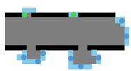  
Fig. 1: Representative Frontier and Doorway Detection: Frontier cells (light blue) are sampled to form representative frontiers (blue dots), while potential doorways (green dots) are identified based on structural gaps in frontier regions.

-Frontier cells   
●-Representative Frontiers   
●- Potential Doorways

search task, the problem is considered solved once the object of interest has been observed such that $g _ { i n t } \in \mathcal { G } _ { f r } \cup \mathcal { G } _ { o c }$ .

We consider an MRS consisting of $M$ robots. The state of robot $i$ at time step $t$ is defined by its 2D position vector $X _ { i } ^ { t } = [ x _ { i } ^ { t } y _ { i } ^ { t } ] ^ { T } \in \mathbb { R } ^ { 2 }$ . To ensure collision avoidance, robots must maintain a minimum safety distance $d _ { s a f e } > 0$ from one another, such that $| | X _ { i } ^ { t } - X _ { j } ^ { t } | | _ { 2 } \geq d _ { s a f e }$ for all $i \neq j$ and all time steps $t$ . Each robot $i$ is equipped with a 2D LiDAR sensor characterized by a maximum detection range $d _ { d e t } ^ { i } \in \mathbb { R }$ and a circular field of viehas a maximum velocity V). In adsuch that $i$ $V _ { m a x } ^ { i }$ $\lvert | X _ { i } ^ { t + 1 } - X _ { i } ^ { t } \rvert | _ { 2 } \leq$ $| | V _ { m a x } ^ { i } | | _ { 2 } \ \forall t$ . At any given time, the robot can observe all grid cells within a Euclidean distance less than or equal to $d _ { d e t } ^ { i }$ from its current position, if those cells are not occluded by obstacles. We define a characteristic vector for each robot as $K _ { i } = [ d _ { \mathrm { d e t } } ^ { i } , ~ | | V _ { \operatorname* { m a x } } ^ { i } | | _ { 2 } ] ^ { T } \in \mathbb { R } ^ { 2 }$ , which encapsulates sensing range and mobility that are critical for efficient exploration.

# IV. LLM-MCOX FRAMEWORK

LLM-MCoX framework leverages the multi-modal reasoning capabilities of LLMs to integrate both structured spatial information, including frontiers and doorways extracted from a shared global occupancy map, and unstructured semantic cues expressed in natural language. By fusing these complementary sources of information, LLM-MCoX enables more informed and adaptive planning, allowing robot teams to coordinate effectively and explore previously unknown environments with greater efficiency.

# A. Representative Frontier Detection

Frontier cells are defined as free cells adjacent to unknown regions in the occupancy map (Fig. 1). In large environments, the number of frontier cells can be prohibitively high, making it computationally expensive to consider them all. Thus, many existing methods perform clustering or sampling to identify a subset of informative candidates [8], [20].

In our method, we randomly sample $H _ { f }$ frontier cells and rank them using the following utility function:

$$
U (\mathbf {g}) = s (\mathbf {g}) - \lambda c (\mathbf {g}); \tag {1}
$$

here, g is the frontier cell sampled, $s ( \mathbf { g } )$ represents the estimated information gain (calculated as the proportion of unknown cells that would fall within the robot’s LiDAR range if it were located at g), and $c ( \mathbf { g } )$ denotes the distance from the closest robot to g. The parameter $\lambda$ balances exploration utility $s ( \mathbf { g } )$ and travel cost $c ( \mathbf { g } )$ . The top $K _ { f }$ frontier cells with the highest utility scores are then selected, while enforcing a minimum separation distance $d _ { s e p }$ between any selected frontiers. These high-utility frontiers serve as representative frontiers for subsequent planning and coordination.

# B. Doorway Detection

To complement frontier-based exploration with higherlevel semantic cues, we introduce a lightweight doorway detection heuristic inspired by geometric features observed in LiDAR data [34]. Similar to frontier detection, we start from sampling $H _ { d }$ candidate frontier cells. For each candidate, we cast rays in $Q$ discrete directions and examine symmetric wall boundaries on both sides to identify narrow gaps consistent with doorway shapes.

If walls are detected symmetrically on both sides within a threshold width, as shown in Fig. 1, the midpoint is marked as a potential doorway. To reduce false positives, we estimate the information gain $s ( \mathbf { g _ { d } } )$ around each candidate gd and discard low information candidates. Additionally, we apply a minimum separation constraint $d _ { s e p }$ to ensure spatial diversity among detected doorways. This efficient and geometry-aware approach allows the system to detect semantically meaningful navigational features in partially explored maps with minimal computational overhead.

# C. LLM-Based Multi Robot-Exploration

Unlike traditional methods that rely exclusively on frontiers [8] or geometric cues such as doorways [34], LLM-MCoX enables the LLM to jointly reason over multiple information sources, including both representative frontiers and potential doorways and multiple modalities, such as a shared LiDAR-based occupancy map in image and highlevel natural language initial information. These multi-modal inputs are passed to the LLM in a template prompt, and the LLM outputs a sequence of waypoints for each robot (Fig. 2) — LLM-MCoX to act as a centralized high-level planner, assigning globally informed, semantically meaningful goals that are grounded in both map geometry and task context.

The LLM-MCoX algorithm begins by initializing a global occupancy grid map, where all cells are initially marked as unknown. A planning cycle is triggered either when all robots have reached their previously assigned waypoints or when a fixed time horizon $T _ { H }$ has elapsed since the last planning (Line 9). In each planning, the system extracts structured information from the shared LiDAR map, including representative frontiers and potential doorway locations (Line 10). The global grid map $\mathbf { G } _ { t }$ is then encoded into a grayscale image representation via a base-64 encoding scheme (Line 11).

The LLM planner is queried with both structured and unstructured inputs. Structured inputs include the extracted frontiers and doorways, the current states and characteristics of all robots, and the grayscale LiDAR map image. Unstructured inputs include natural language descriptions (e.g., Key Initial Information, if available), execution summaries from the low-level controllers, and the previous plan summary generated by the LLM in the previous planning cycle.

At each planning step (Line 12), the LLM assigns a sequence of waypoints $\mathcal { W } _ { i } ^ { t } = [ w _ { i , 1 } ^ { t } , w _ { i , 2 } ^ { t } , . . . , w _ { i , n _ { i } ^ { t } } ^ { t } ]$ for each robot $i$ to explore, where the number of waypoints $n _ { i } ^ { t }$ may vary across both robots and planning cycles. An example LLM query-response interaction is shown in Fig. 3. Note that the LLM is not constrained to select waypoints strictly from

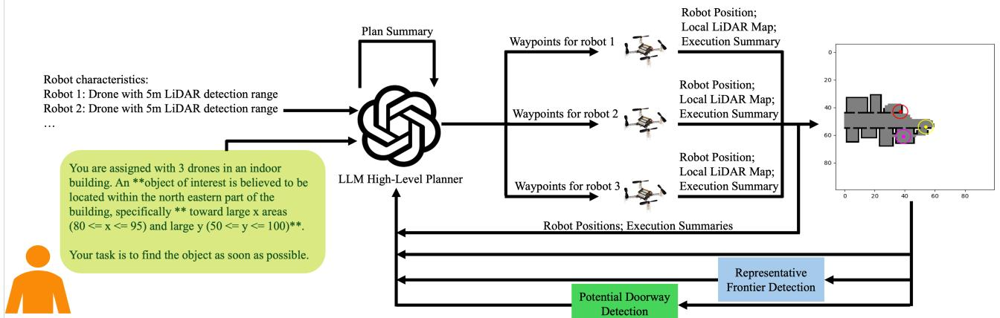  
Fig. 3: Example query and response from the LLM for waypoints assignments of a multi-robot team.

Fig. 2: LLM-MCoX Planning Pipeline. At each cycle, robots share LiDAR maps to update a global shared known map, from which representative frontiers and potential doorways are extracted. These geometric features, together with robot states, execution summaries, characteristics, and the previous plan, are provided to the LLM-based planner for waypoint assignment. Optional natural-language input from human operators can supply semantic cues for targeted exploration.

# Algorithm 1 LLM-MCoX

1: Initialize global map $\mathbf { G } _ { 0 } \in \mathbb { Z } ^ { H \times W }$ as all zeros

2: ▷ -1 = unknown, $0 =$ free, $1 = \mathrm { w a l l }$

3: Initialize robot states and features $\{ X _ { i } ^ { 0 } \} _ { i = 1 } ^ { M } , \{ K _ { i } \} _ { i = 1 } ^ { M }$

4: Plan summary $S ^ { \mathrm { p l a n } }  \emptyset$ , execution summary $S ^ { \mathrm { e x e c } }  \emptyset$

5: Global timestep $t \gets 0$ , time since last plan $t _ { \mathrm { s i n c e \mathrm { . p l a n } } }  0$

6: Initialize waypoint queues $\{ \mathcal { W } _ { i } ^ { t } \} _ { i = 1 } ^ { M }  \emptyset$

7: Optional: Key Initial Information $\mathcal { T } _ { \mathrm { i n i t } }$

8: while exploration/search not complete do

9: if $\{ \mathcal { W } _ { i } ^ { t } \} _ { i = 1 } ^ { M } = = \varnothing$ or $t _ { \mathrm { s i n c e \mathrm { - p l a n } } } \geq T _ { H }$ then

10: Detect frontiers $\mathcal { F } _ { t }$ and doorways $\mathcal { D } _ { t }$ from $\mathbf { G } _ { t }$

11: Render LiDAR map image $C _ { \mathrm { m a p } } ^ { t }$ from $\mathbf { G } _ { t }$

12: $S ^ { \mathrm { p l a n } }$ , $\begin{array} { r l r } { \{ \mathcal { W } _ { i } ^ { t } \} _ { i = 1 } ^ { M } } & { { } = } & { \mathrm { L L M } ( \mathcal { F } _ { t } , \quad \mathcal { D } _ { t } , \quad \{ \mathbf { x } _ { i } ^ { t } \} _ { i } ^ { l } } \end{array}$ $\mathcal { D } _ { t }$ $\{ \mathbf { x } _ { i } ^ { t } \} _ { i = 1 } ^ { M }$

{Ki}Mi=1, $C _ { \mathrm { m a p } } ^ { t }$ , Iinit, S plan, S exec)

13: Reset $\bar { t } _ { \mathrm { s i n c e \mathrm { - } p l a n } }  0$ , clear $S ^ { \mathrm { e x e c } }$

14: end if

15: for robot $i = 1$ to $M$ do

16: if $\mathcal { W } _ { i } ^ { t }$ is not empty then

17: Let $w _ { i , \mathrm { n e x t } } ^ { t } = \mathscr { W } _ { i } ^ { t } [ 0 ]$

18: if $w _ { i , \mathrm { n e x t } } ^ { t }$ is not reachable then

19: $\dot { S } ^ { \mathrm { e x e c } } ~ { + } = \ddot { } ^ { \ast } w _ { i , \mathrm { n e x t } } ^ { t }$

20: Remove $w _ { i , \mathrm { n e x t } } ^ { t }$ from $\mathcal { W } _ { i } ^ { t }$

21: else

22: Move robot $i$ toward $w _ { i , \mathrm { n e x t } } ^ { t }$

23: $i$ $w _ { i , \mathrm { n e x t } } ^ { t }$

Remove $w _ { i , \mathrm { n e x t } } ^ { t }$ from $\mathcal { W } _ { i } ^ { t }$

end if

Update local map $\mathbf { G } _ { t } ^ { i }$

end if

end if

end for

Merge local maps into shared known map $\mathbf { G } _ { t + 1 }$

$t \gets t + 1$ , $t _ { \mathrm { s i n c e - p l a n } }  t _ { \mathrm { s i n c e - p l a n } } + 1$

32: end while

the pre-detected frontier or doorways, as in [32]. Instead, it can also visually reason over the global map to identify promising unexplored regions beyond those detected heuris-

Role:You area helpful centralized planner for a team of indoor robots.Your task is to reason globallyand generatestrategic waypoint plans foreachrobot,basedontheircurrent statesandthe shared environment map (visualized in the image).

Robot Features:

Robot 1: Drone with 5m LiDAR detection range, maximum speed of 1m/s; Robot 2:...

Shared LiDAR Map:

LiDAR_image $=$ base64.b64encode(LiDAR_bytes).decode("utf-8")

Key Initial Information (Optional): You are assigned with 3 robots in an indoor building. An objectofinterestisbelievedtobelocatedwithinthenortheasternpartofthebuilding,specifically **towardlargexareas $8 0 < = { \bf x } < = 9 5$ )andlargey $( 5 0 < = \mathbf { y } < = 1 0 0 ) ^ { * * }$

Yourtaskistofindtheobjectassoonaspossible.

DetectedRepresentativeFrontiers: {[45,52], [61,54],.,[52,62]} DetectedPoteniaorways:{[121],[44,5],,[58,62]}

Robot Current Position: {Robot 1: [44,52]}, {Robot 2: [50,56]}),Robot3: [62,4]}

Execution Summary: {Robot 1: having trouble arriving at [48,54]},.,Ω}

Previous PlanSummary: {Robot l isasigned to explore local frontiers,Robot2 isasigned.. )

Exploration Guidelines:

-For each drone, plan step-by-step:

1.Analyze known information and whether the previous plan was executed successfully.

2.Prioritize unexplored doorwaysover frontiers (doorwaysoften open larger newareas). 3.Selectnearbydoorwaysorfrontierclustersbasedonproximityandseparation.

Output the assgned waypoints with your reasoning and plan summary in the following format: {f "Reasonig":".","PlanSummary":".

$$
^ {\prime \prime} A s s i g n m e n t s ^ {\prime \prime}: \{\{\}
$$

$$
" 1 "; [ \{\{ " p o s i t i o n": [ y, x ], " m o d e": \dots " ] \}, \dots ],
$$

$$
2 ^ {\prime \prime} : \left[ \{\{\text {" p o s i t i o n " : [ v , x ] , " m o d e " : " " ]} \right] \dots
$$

$$
\begin{array}{c} \dots \end{array} \{\{\{\} \} \}
$$

LLM Response:

"Reasoning": "The objective is to find the object in the region where $y > = 5 0$ and $8 0 < = \mathbf { x } < = 9 5$ There are no unexplored doorways or frontier clusters in that exact prioritized region.... Drone 1is instructed tocontinue exploring downthecorridor,focusing onfrontier clustersto the west ofthetargetregion.Drone2&3 shouldmove towardsthecorridor frontierpointswhile preparing to head east towards the prioritized zone.",

"PlanSummary": "Drone 1 explores west corridor,focusing on approaching east by navigating aroundobstacles.Drone2moves towardanavailablecorridor frontier around itspositionand explores east. Drone 3 takes similar steps along the corridor route exploring towards east moving closer to the prioritized zone.Plan adapts to previous issues without causing backtracking.",

"Assignments":

$$
\{\text {" 1 "} \colon [ \{\text {" p o s i t i o n "} \colon [ 4 3, 4 8 ] \}, \{\text {" p o s i t i o n "} \colon [ 4 5, 5 2 ] \}, \{\text {" p o s i t i o n "} \colon [ 5 7, 6 3 ] \} ],
$$

$$
^ {\prime \prime} 2 ^ {\prime \prime}: [ \{\text {" p o s i t i o n":} [ 5 2, 6 4 ] \}, \{\text {" p o s i t i o n":} [ 5 2, 7 1 ] \} ],
$$

$$
3 ^ {\prime \prime} {:} [   \{\text {" p o s i t i o n": [ 6 1, 5 4 ]} \}, \{\text {" p o s i t i o n": [ 6 3, 6 5 ]} \}, \{\text {" p o s i t i o n": [ 6 1, 7 2 ]} \} ]
$$

tically. This capability allows LLM-MCoX to expand the planning space intelligently, leveraging both geometric cues and broader spatial context from the global LiDAR map.

Since current LLM APIs do not retain memory across sessions, LLM-MCoX incorporates an explicit plan summarization mechanism to maintain temporal continuity in decision-making. At the end of each planning cycle, the LLM is prompted to generate a plan summary, denoted $S ^ { p l a n }$ , alongside the waypoint assignments. This summary is reused as part of the prompt in the subsequent cycle, providing con-

  
(a) Medium Map

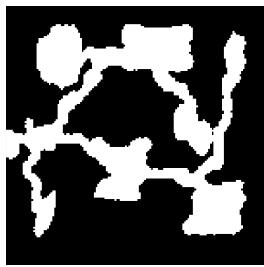  
(b) Unstructured Map   
Fig. 4: Example simulation environments used for evaluation.

textual grounding that helps preserve coherence across planning iterations. The assigned waypoints are then sequentially executed by each robot’s low-level controller (Line 15-29).

To support adaptive behavior, the LLM also integrates execution summaries, denoted $S ^ { e x e c }$ (Line 19), which report whether each robot successfully reached its previously assigned waypoints. These summaries allow the planner to incorporate feedback from low-level controllers, helping it avoid infeasible or redundant assignments in future cycles. After every timestep, each robot’s local LiDAR scan is merged into the shared global map, enabling a continually updated representation of the environment (Line 30).

A distinctive feature of our approach is the LLM’s ability to reason over key initial information provided in natural language. For example, if the input includes a statement such as the object of interest is likely located in the northeastern part of the building, the LLM can integrate this highlevel semantic guidance with the spatial map and current robot positions to relevant regions accordingly. This semantic grounding enables the planner to go beyond purely geometrydriven decision-making and adapt its strategy based on abstract goals or vague human-specified hints. By fusing this key initial information with real-time sensory and spatial data, the LLM serves as a centralized high-level planner that generates context-aware, goal-driven waypoint assignments. This design extends beyond the capabilities of conventional geometric or heuristic planners, enabling flexible and intelligent behavior in partially observed environments.

# V. SIMULATION RESULTS

We evaluate the effectiveness of LLM-MCoX framework in comprehensive simulations for both exploration and search tasks in structured and unstructured environments (Fig. 4). Each robot is equipped with a low-level $\mathbf { A } ^ { * }$ path planner for navigating toward its assigned waypoints. To enable decentralized collision avoidance, each robot maintains a temporary local map with the current positions of other robots modeled as circular obstacles with a $d _ { s a f e } = 1$ radius.

We consider two types of scenarios. The first are structured environments with a homogeneous robot team (identical sensing and motion capabilities), similar to indoor buildings from Fig. 4a. The second examines unstructured environments, similar to natural caves as in Fig. 4b, incorporating both homogeneous and heterogeneous robots varying in sensor range and mobility, i.e., maximum speed.

# A. Baselines

We compare LLM-MCoX against the following baselines: (i) Mean-shift-Greedy (adapted from [8]), which applies a mean-shift clustering algorithm to group frontier points and selects the most promising frontier for exploration; (ii) sample-Greedy (based on [20]), which selects representative frontiers by sampling points according to a utility function that balances expected information gain and travel cost. To enable fair comparison in a multi-robot setting, we extend these methods by assigning each robot its most suitable unassigned frontier greedily while ensuring no duplicates by actively removing previously selected frontiers.

However, these baselines do not explicitly account for coordination or workload balancing across multiple robots by having long-horizon plans. To address this limitation, we include a third baseline, Sample-DVC, which implements a MRS coordination strategy based on Dynamic Voronoi Cells (DVC) [35]. It divides the environment according to the vicinity of each robot and assigns multiple frontiers within its region, allowing for more long-term planning compared to greedy strategies that assign only one frontier per robot. In our implementation, we use the same sampling-based frontier detection from [20] but assign the frontiers using DVC partitioning. Although more sophisticated methods, such as solving a Capacitated Vehicle Routing Problem (CVRP), have been proposed for balanced task assignment in MRS [13], their NP-hard complexity makes it impractical for larger teams and was only demonstrated with two robots.

In contrast, the DVC-based approach scales efficiently by partitioning the workspace and assigning frontiers to robots based on spatial proximity. Similar to LLM-MCoX, DVC synchronizes task planning by waiting for all robots to complete their current assignments before initiating a new planning cycle. To efficiently visit their assigned frontiers, each robot independently solves a decentralized Traveling Salesman Problem (TSP), following the original work [13].

# B. Homogeneous Team in Structured Environments

We initially evaluate LLM-MCoX in structured environments of three different map sizes: small $H = W = 6 0$ ), medium $\textstyle H = W = 1 2 0$ ), and large $\cdot H = W = 1 5 0$ ); each features a central horizontal corridor with randomly sized rooms placed along both the top and bottom sides. For structural variability, each pair of adjacent rooms has a $50 \%$ probability of being connected by an inter-room doorway.

For each map size, we randomly generate 10 unique environment instances, resulting in a diverse set of 30 structured maps for comprehensive evaluation. For the search task, object positions are sampled within each environment and filtered to maintain comparable levels of search difficulty. The team consists of homogeneous robots with a unit speed (one cell per timestep) and a LiDAR detection range of 5 cells.

To facilitate clear comparison and consistent visualization of performance across methods, we impose a maximum timestep limit of 1000, 1500, and 2000 for small, medium, and large maps, respectively. These limits are chosen to

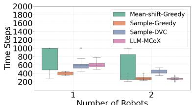  
(a) Exploration (Small)

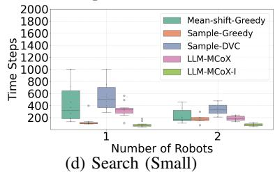

  
(b) Exploration (Medium)

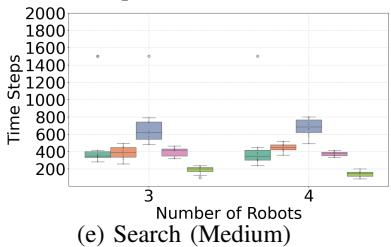

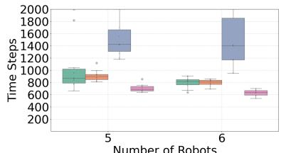  
(c) Exploration (Large)

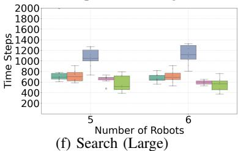  
Fig. 5: Exploration and search performance across small, medium, and large environments. For each method, results are collected over 10 randomized maps per environment size, and performance is summarized using quartile plots.

ensure that all methods have sufficient time to complete the exploration and search tasks in each environment.

We first evaluate the performance of all methods on the exploration task across three map sizes and varying team sizes; the results are summarized in Fig. 5. Among the baselines, the Sample-Greedy method consistently performs best. This is primarily because, while the Mean-shift-Greedy baseline can generate high-quality representative frontiers and completes exploration in fewer timesteps, sometimes, it tends to overlook small frontier clusters. As a result, it often fails to achieve complete coverage within the allowed time limit, which also explains why the Mean-Shift-Greedy method performs better in search tasks than in exploration tasks, since search tasks do not require full map coverage.

The Sample-DVC method, by contrast, generates longhorizon plans by assigning multiple waypoints to each robot within a single planning cycle. This not only reduces the frequency of replanning compared to greedy strategies that assign only one waypoint at a time but also helps balance the workload among robots by distributing potential waypoints more evenly. Yet, this also reduces adaptability: since new assignments are only generated after all robots complete their current tasks, Sample-DVC can be less responsive to changes in the environment.

LLM-MCoX exhibits similar behavior to the DVCsampling method with single robot scenarios, as it also produces long-horizon waypoint plans. Meanwhile, as the number of robots increases, LLM-MCoX begins to outperform Sample-DVC. It matches the best-performing baseline in scenarios with two to three robots and shows substantial efficiency gains as team size grows. Notably, in large environments with six robots, LLM-MCoX achieves an average improvement of $2 2 . 7 \%$ . This highlights the LLM-MCoX strength in effectively coordinating large MRS to improve overall exploration performance in complex environments.

A similar trend is observed in the search task results. Sample-Greedy continues to outperform the other baselines in general, while LLM-MCoX catches up and eventually surpasses it as the number of robots increases. Moreover,

the efficiency of LLM-MCoX can be further improved by incorporating initial information. When provided with a natural language hint about the likely location of the target, the informed variant LLM-MCoX-I consistently achieves the best performance across all settings. Remarkably, LLM-MCoX-I even outperforms Sample-Greedy in the single-robot case by $39 \%$ , highlighting its unique advantage: the ability to integrate high-level natural language guidance into the planning process. This capability is especially valuable for real-world search tasks, such as search-and-rescue operations in buildings, where victims may provide approximate verbal descriptions of where others are located. By leveraging such semantic cues, LLM-MCoX-I enables more targeted and efficient search behavior, demonstrating the practical potential of LLMs in robot team coordination.

# C. Homogeneous and Heterogeneous Team Search in Unstructured Environments

In this set of experiments, we extend our evaluation to more unstructured environments with $H \ = \ W \ = \ 1 5 0 .$ , resembling large natural caves, as illustrated in Fig. 4b. These environments present greater complexity and irregularity compared to structured indoor maps, making the search task more challenging. The object of interest is randomly sampled for each environment in its reachable free space. To further assess the adaptability of LLM-MCoX, we evaluate performance with both homogeneous and heterogeneous robot teams. This allows us to demonstrate the capability to reason over diverse robot features, such as sensing range and mobility, and assign tasks accordingly in a context-aware and efficient manner.

For the homogeneous robot team, each robot is configured with a unit speed (one cell per timestep) and a LiDAR detection range of 5 cells. In contrast, the heterogeneous team consists of two types of robots: (1) faster robots with a speed of 3 cells per timestep but a shorter detection range of 5 cells $( d _ { d e t } ^ { i } )$ , and (2) slower robots with a speed of 1 cell per timestep but a longer detection range of 10 cells $( d _ { d e t } ^ { i } )$ .

As shown in Fig. 6a, the LLM-MCoX method outperforms

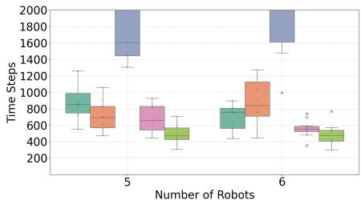

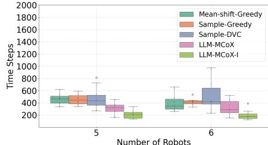  
(a) Search with a homogeneous robot team.   
(b) Search with a heterogeneous robot team.   
Fig. 6: Comparison of search performance across team configurations in unstructured environments.

the best performing baseline by reducing average time steps by $5 \%$ in the homogeneous setting with a team size of 5. Consistent with the results in structured environments, the advantage of LLM-MCoX becomes more obvious as the team size increases. With 6 robots, LLM-MCoX achieves a $1 9 . 6 \%$ reduction in average time steps compared to the Mean-shift-Greedy, which is the best baseline in this scenario. Moreover, when initial information is provided in natural language, the LLM can more effectively prioritize relevant search regions, leading to a substantial performance boost. In this setting, LLM-MCoX reduces the number of time steps to $30 . 5 \%$ of those required by Mean-shift-Greedy when operating with 6 robots.

In the heterogeneous team setting, where 2–3 robots are faster with limited sensing range and the remaining 3 are slower but have extended sensing capabilities, LLM-MCoX demonstrates a clear advantage by assigning waypoints based on each robot’s individual characteristics (Fig. 6b). LLM-MCoX outperforms all baselines for both 5 robot and 6 robot teams, reducing average time steps by ${ \sim } 3 0 \%$ compared to the best performing baseline (i.e., Sample-Greedy). This improvement is due to LLM-MCoX’s ability to reason over robot-specific capabilities and assign tasks accordingly, a feature that none of the baselines can incorporate in their assignments. Similar to the homogeneous case, providing high-level natural language input further enhances search efficiency by allowing the planner to align semantic cues with each robot’s unique strengths. In this setting, LLM-MCoX achieves up to a $50 \%$ reduction in time-steps for both team sizes compared to the best baseline (i.e., Sample-Greedy).

# D. LLM Planning Time

One of the main limitations of using an LLM for MRS coordination lies in the computational time required to generate a motion plan. On average, the LLM is queried approximately 20 times per simulation run to complete the tasks described in Sec. V-B and Sec. V-C. As shown in Fig. 7, the planning time for LLM-MCoX increases with the number

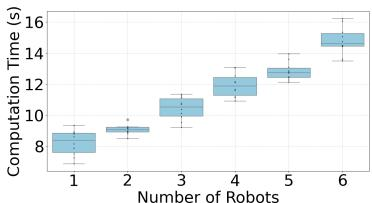  
Fig. 7: Computational Time for LLM-MCoX to generate one plan across different numbers of robots

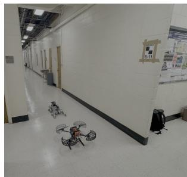  
(a) Robots Setup

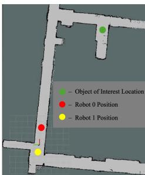  
(b) Ground Truth Map   
Fig. 8: Search experiment conducted in a hall

of robots, due to the growing complexity of reasoning over a larger team. In the current implementation, all robots must remain idle and wait at their current positions until the LLM completes the planning process. This synchronous waiting introduces inefficiencies, particularly in larger teams. The overall performance of LLM-MCoX could be further improved by reducing the computation time or by allowing robots to continue limited actions, such as exploration or holding short-term goals, while awaiting the next plan.

# VI. REAL WORLD EXPERIMENTS

To evaluate the applicability of the LLM-MCoX framework in coordinating heterogeneous robotic teams with different locomotion abilities in realistic settings, we conducted experiments in indoor building environments that resemble the structured scenarios used in simulation. The heterogeneous team consisted of a Unitree Go2 quadruped and a customized X500 quadrotor equipped with an Intel NUC (11th Gen i7 CPU) (Fig. 8a). Both robots carried Livox Mid-360 LiDAR sensors for localization and mapping. For safety, the drone’s maximum velocity was limited to $1 . 0 ~ \mathrm { m / s }$ , while the Go2 operated up to $2 . 5 ~ \mathrm { m } / \mathrm { s }$ .

The robots were tasked with searching for a target (green point in Fig. 8b), given the prior knowledge that it lay to the northeast of their initial deployment (red: Go2, yellow: drone). Robot specifications and task priors were provided to the LLM planner. Each robot performed localization with SLAM Toolbox [36] and local waypoint following with Nav2 [37] on onboard computers. Map and pose updates were transmitted via Wi-Fi to a central computer (Intel i7 CPU, 32 GB RAM), which executed the LLM-based planner and assign waypoints in near real time with a replanning horizon of 20 seconds. The experiments demonstrate that LLM-MCoX can coordinate heterogeneous robots in realistic indoor environments, achieving near real-time planning and execution (a video is attached as supplementary material).

# VII. CONCLUSION

In this paper, we introduced LLM-MCoX, a novel framework that leverages LLM as a high-level planner to coordinate MRS for exploration and search tasks in unknown environments. The LLM operates on a shared LiDAR-based map and integrates both structured spatial data and unstructured natural language instructions. Through comprehensive simulation and real-world experiments, we demonstrated that LLM-MCoX significantly improves exploration and search efficiency compared to several widely used baseline methods. Moreover, we showcased the unique ability of the proposed framework to incorporate high-level natural language guidance, an advantage that traditional methods cannot easily replicate. Future work will explore incorporating additional onboard sensors, such as cameras, to enable real-time semantic understanding and allow the system to respond dynamically to environmental cues beyond the initial instruction. In addition, as we observed, the planning time increases with the number of robots. Future improvements should consider reducing LLM response time or enabling asynchronous execution, allowing robots to continue local operations while awaiting high-level coordination updates.

# REFERENCES

[1] H. Sugiyama, T. Tsujioka, and M. Murata, “Real-time exploration of a multi-robot rescue system in disaster areas,” Advanced Robotics, vol. 27, no. 17, pp. 1313–1323, 2013.   
[2] M. Dunbabin and L. Marques, “Robots for environmental monitoring: Significant advancements and applications,” IEEE Robotics & Automation Magazine, vol. 19, no. 1, pp. 24–39, 2012.   
[3] T. Roucek, M. Pecka, P. ˇ Cˇ ´ızek, T. Pet ˇ ˇr´ıcek, J. Bayer, V. ˇ Salansk ˇ y,` D. Heˇrt, M. Petrl´ık, T. Ba´ca, V. Spurn ˇ y` et al., “Darpa subterranean challenge: Multi-robotic exploration of underground environments,” in Modelling and Simulation for Autonomous Systems: 6th Int. Conf. MESAS, Revised Selected Papers 6, 2020, pp. 274–290.   
[4] A. Bircher, M. Kamel, K. Alexis, H. Oleynikova, and R. Siegwart, “Receding horizon” next-best-view” planner for 3d exploration,” in 2016 IEEE ICRA, 2016, pp. 1462–1468.   
[5] C. Witting, M. Fehr, R. Bahnemann, H. Oleynikova, and R. Siegwart, ¨ “History-aware autonomous exploration in confined environments using mavs,” in 2018 IEEE/RSJ IROS, 2018, pp. 1–9.   
[6] M. Selin, M. Tiger, D. Duberg, F. Heintz, and P. Jensfelt, “Efficient autonomous exploration planning of large-scale 3-d environments,” IEEE Robotics and Automation Letters (RA-L), vol. 4, no. 2, pp. 1699– 1706, 2019.   
[7] A. Batinovic, T. Petrovic, A. Ivanovic, F. Petric, and S. Bogdan, “A multi-resolution frontier-based planner for autonomous 3d exploration,” IEEE RA-L, vol. 6, no. 3, pp. 4528–4535, 2021.   
[8] I. D. C. Caiza, A. Milas, M. A. M. Grova, F. J. Perez-Grau, and ´ T. Petrovic, “Autonomous exploration of unknown 3d environments using a frontier-based collector strategy,” in 2024 IEEE ICRA, 2024, pp. 13 566–13 572.   
[9] Y. Chen, J. Arkin, Y. Zhang, N. Roy, and C. Fan, “Scalable multi-robot collaboration with large language models: Centralized or decentralized systems?” in 2024 IEEE ICRA, 2024, pp. 4311–4317.   
[10] S. S. Kannan, V. L. Venkatesh, and B.-C. Min, “Smart-llm: Smart multi-agent robot task planning using large language models,” in 2024 IEEE/RSJ IROS, 2024, pp. 12 140–12 147.   
[11] R. Calandra, A. Owens, D. Jayaraman, J. Lin, W. Yuan, J. Malik, E. H. Adelson, and S. Levine, “More than a feeling: Learning to grasp and regrasp using vision and touch,” IEEE RA-L, vol. 3, no. 4, pp. 3300– 3307, 2018.   
[12] P. Petra´cek, V. Kr ˇ atk ´ y, M. Petrl ` ´ık, T. Ba´ca, R. Kratochv ˇ ´ıl, and M. Saska, “Large-scale exploration of cave environments by unmanned aerial vehicles,” IEEE RA-L, vol. 6, no. 4, pp. 7596–7603, 2021.   
[13] B. Zhou, H. Xu, and S. Shen, “Racer: Rapid collaborative exploration with a decentralized multi-uav system,” IEEE Transactions on Robotics, vol. 39, no. 3, pp. 1816–1835, 2023.

[14] C. Papachristos, S. Khattak, and K. Alexis, “Uncertainty-aware receding horizon exploration and mapping using aerial robots,” in 2017 IEEE ICRA, 2017, pp. 4568–4575.   
[15] A. Bircher, M. Kamel, K. Alexis, H. Oleynikova, and R. Siegwart, “Receding horizon path planning for 3d exploration and surface inspection,” Autonomous Robots, vol. 42, pp. 291–306, 2018.   
[16] B. Zhou, Y. Zhang, X. Chen, and S. Shen, “Fuel: Fast uav exploration using incremental frontier structure and hierarchical planning,” IEEE RA-L, vol. 6, no. 2, pp. 779–786, 2021.   
[17] A. Mobarhani, S. Nazari, A. H. Tamjidi, and H. D. Taghirad, “Histogram based frontier exploration,” in 2011 IEEE/RSJ IROS, 2011, pp. 1128–1133.   
[18] Y. Tang, J. Cai, M. Chen, X. Yan, and Y. Xie, “An autonomous exploration algorithm using environment-robot interacted traversability analysis,” in 2019 IEEE/RSJ IROS, 2019, pp. 4885–4890.   
[19] B. Charrow, G. Kahn, S. Patil, S. Liu, K. Goldberg, P. Abbeel, N. Michael, and V. Kumar, “Information-theoretic planning with trajectory optimization for dense 3d mapping.” in Robotics: Science and Systems, vol. 11. Rome, 2015, pp. 3–12.   
[20] A. Dai, S. Papatheodorou, N. Funk, D. Tzoumanikas, and S. Leutenegger, “Fast frontier-based information-driven autonomous exploration with an mav,” in 2020 IEEE ICRA, 2020, pp. 9570–9576.   
[21] V. P. Tran, M. A. Garratt, K. Kasmarik, S. G. Anavatti, and S. Abpeikar, “Frontier-led swarming: Robust multi-robot coverage of unknown environments,” Swarm and Evolutionary Computation, vol. 75, p. 101171, 2022.   
[22] J. Butzke and M. Likhachev, “Planning for multi-robot exploration with multiple objective utility functions,” in 2011 IEEE/RSJ IROS, 2011, pp. 3254–3259.   
[23] X. Wang, J. Xu, C. Gao, Y. Chen, J. Zhang, C. Wang, Y. Ding, and B. M. Chen, “Sensor-based multi-robot coverage control with spatial separation in unstructured environments,” in 2024 IEEE ICRA, 2024, pp. 10 623–10 629.   
[24] J. Hu, H. Niu, J. Carrasco, B. Lennox, and F. Arvin, “Voronoibased multi-robot autonomous exploration in unknown environments via deep reinforcement learning,” IEEE Transactions on Vehicular Technology, vol. 69, no. 12, pp. 14 413–14 423, 2020.   
[25] R. Zlot, A. Stentz, M. B. Dias, and S. Thayer, “Multi-robot exploration controlled by a market economy,” in 2002 IEEE ICRA, vol. 3, 2002, pp. 3016–3023.   
[26] A. J. Smith and G. A. Hollinger, “Distributed inference-based multirobot exploration,” Autonomous Robots, vol. 42, no. 8, pp. 1651–1668, 2018.   
[27] J. Yu, J. Tong, Y. Xu, Z. Xu, H. Dong, T. Yang, and Y. Wang, “Smmr-explore: Submap-based multi-robot exploration system with multi-robot multi-target potential field exploration method,” in 2021 IEEE ICRA, 2021, pp. 8779–8785.   
[28] S. Bone, L. Bartolomei, F. Kennel-Maushart, and M. Chli, “Decentralised multi-robot exploration using monte carlo tree search,” in 2023 IEEE/RSJ IROS, 2023, pp. 7354–7361.   
[29] W. Yu, J. Peng, Y. Ying, S. Li, J. Ji, and Y. Zhang, “Mhrc: Closedloop decentralized multi-heterogeneous robot collaboration with large language models,” arXiv:2409.16030, 2024.   
[30] Z. Mandi, S. Jain, and S. Song, “Roco: Dialectic multi-robot collaboration with large language models,” in IEEE ICRA, 2024, pp. 286–299.   
[31] A. Rajvanshi, P. Sahu, T. Shan, K. Sikka, and H.-P. Chiu, “Sayconav: Utilizing large language models for adaptive collaboration in decentralized multi-robot navigation,” arXiv:2505.13729, 2025.   
[32] B. Yu, H. Kasaei, and M. Cao, “Co-navgpt: Multi-robot cooperative visual semantic navigation using large language models,” arXiv:2310.07937, 2023.   
[33] Z. Shen, H. Luo, K. Chen, F. Lv, and T. Li, “Enhancing multirobot semantic navigation through multimodal chain-of-thought score collaboration,” in Proceedings of the AAAI Conference on Artificial Intelligence, vol. 39, no. 14, 2025, pp. 14 664–14 672.   
[34] S. Kim, M. Corah, J. Keller, G. Best, and S. Scherer, “Multi-robot multi-room exploration with geometric cue extraction and circular decomposition,” IEEE RA-L, vol. 9, no. 2, pp. 1190–1197, 2023.   
[35] O. Arslan and D. E. Koditschek, “Voronoi-based coverage control of heterogeneous disk-shaped robots,” in 2016 IEEE ICRA, 2016, pp. 4259–4266.   
[36] S. Macenski and I. Jambrecic, “Slam toolbox: Slam for the dynamic world,” J. of Open Source Software, vol. 6, no. 61, p. 2783, 2021.   
[37] S. Macenski, F. Mart´ın, R. White, and J. Gines Clavero, “The marathon ´ 2: A navigation system,” in IEEE/RSJ IROS, 2020, pp. 2718–2725.