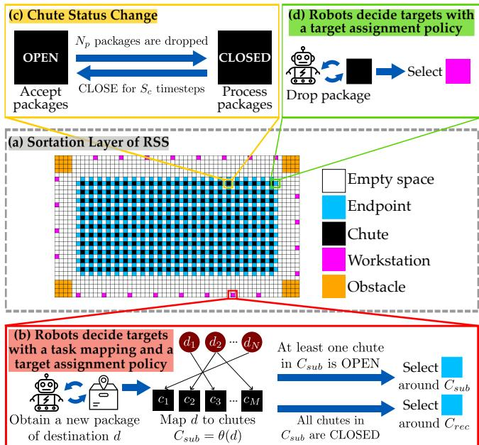
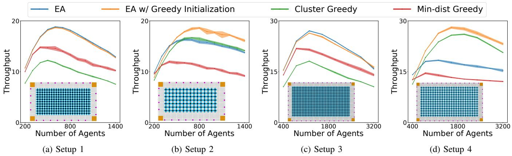
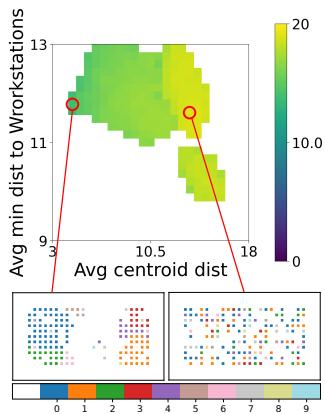
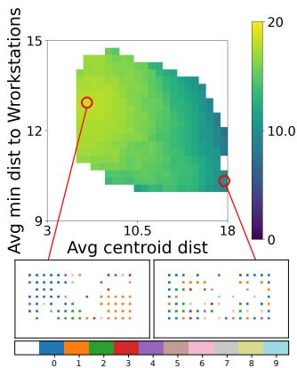
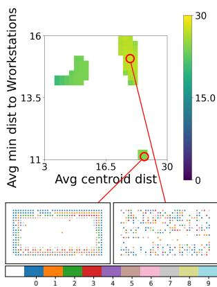
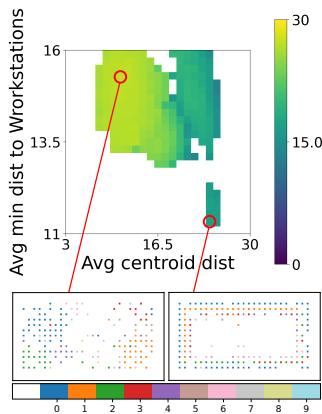

# Destination-to-Chutes Task Mapping Optimization for Multi-Robot Coordination in Robotic Sorting Systems

Yulun Zhang1, Alexandre O. G. Barbosa2, Federico Pecora2, Jiaoyang Li1

Abstract— We study optimizing a destination-to-chutes task mapping to improve throughput in Robotic Sorting Systems (RSS), where a team of robots sort packages on a sortation floor by transporting them from induct workstations to eject chutes based on their shipping destinations (e.g. Los Angeles or Pittsburgh). The destination-to-chutes task mapping is used to determine which chutes a robot can drop its package. Finding a high-quality task mapping is challenging because of the complexity of a real-world RSS. First, optimizing task mapping is interdependent with robot target assignment and path planning. Second, chutes will be CLOSED for a period of time once they receive sufficient packages to allow for downstream processing. Third, task mapping quality directly impacts the downstream processing, as scattered chutes for the same destination increase package handling time. In this paper, we first formally define task mappings and the problem of Task Mapping Optimization (TMO). We then present a simulator of RSS to evaluate task mappings. We then present a simple TMO method based on the Evolutionary Algorithm and Mixed Integer Linear Programming, demonstrating the advantage of our optimized task mappings over the greedily generated ones in various RSS setups with different map sizes, numbers of chutes, and destinations. Finally, we use Quality Diversity algorithms to analyze the throughput of a diverse set of task mappings. Our code is available online at https://github.com/lunjohnzhang/tmo_public.

# I. INTRODUCTION

We study Task Mapping Optimization (TMO), the problem of optimizing the task mapping in Robotic Sorting Systems (RSS). With the flourishing of e-commerce and online shopping, the demand for more efficient supply chains for delivering packages as quickly as possible is growing rapidly. While preparing the packages for shipping, ecommerce stakeholders need to sort packages based on their shipping destinations. To fulfill the growing demand, major stakeholders such as Amazon [1], [2], JD.com [3], Deppon Express [4], and Shentong Express [5] use RSS with hundreds and thousands of robots to sort packages. Compared to traditional sorting systems based on conveyor belts [6], [7] and Robotic Mobile Fulfillment Systems (RMFS) [8]–[13] used for storing goods, RSS is relatively new with many unaddressed research questions.

Figure 1(a) shows an example RSS map, where robots constantly move between workstations (pink) and endpoints (blue) to transport packages from workstations to chutes (black). When a robot picks up a package at a workstation,

1Yulun Zhang and Jiaoyang Li are with the Robotics Institute, Carnegie Mellon University. {yulunzhang,jiaoyangli}@cmu.edu   
2Alexandre O. G. Barbosa and Federico Pecora are with Amazon Robotics. {aormiga,fpecora}@amazon.com   
This work is done during Yulun’s internship at Amazon Robotics.

  
Fig. 1: Overview of our RSS simulator. (a) Map of the sortation floor of the RSS. (b) At the workstations, each robot picks up a package and decides the target endpoint with a task mapping and a TA policy. (c) Status change of the chutes. Packages can be dropped into OPEN chutes. (d) At the endpoints, each robot drops off the package and decides the next target workstation with a TA policy.

the RSS leverages a pre-defined destination-to-chutes task mapping to map the destination of the package to a set of chutes. The robot selects a chute and an endpoint around it, moves to the endpoint, and drops the package into the chute. Finally, the robot moves to a workstation to pick up the next package. More details are explained in Section IV.

The quality of the task mapping significantly affects the movement patterns of the robots. Since the volume (i.e., number of packages) of different destinations varies, the chutes that are mapped to high-volume destinations can be visited more frequently. If chutes mapped to high-volume destinations are clustered together, robots would travel to endpoints around those chutes more frequently, potentially accumulating congestion and lowering throughput. Meanwhile, if high-volume destinations map to chutes that are close to the workstations, the travel distance of the robots can be reduced and thus improve throughput.

However, TMO is a challenging problem because of the complex nature of an RSS. First, TMO is strongly corre-

lated with other sub-problems in RSS, including (1) robot coordination, the problem of planning collision-free paths for the robots, and (2) target assignment (TA), the problem of selecting appropriate endpoints or workstations for robots to go to. TMO is correlated with these two problems because the movement of the robots is collectively determined by a task mapping, a robot coordination algorithm, and a TA policy. Second, the capacity of the chutes is limited. Once a sufficient number of packages are dropped into a chute, it undergoes a status change, transitioning status to be CLOSED for a certain amount of time, during which no packages can be dropped. Third, the operation of RSS depends not only on the sortation floor on which robots move, but also on the downstream process on a lower shipping floor where the dropped packages are collected for delivery. If chutes of the same destination are clustered together, it would alleviate the workload on the shipping floor, which decreases the amount of time chutes are CLOSED and improves throughput on the sortation floor. This trades off with the fact that clustered chutes of the same destination can impede the movement of the robots. These real-world factors make it challenging to not only solve TMO, but also to develop a simulator that can effectively evaluate a given task mapping.

In this paper, we first formally define Task Mapping Optimization (TMO). To the best of our knowledge, very few prior works have studied TMO in the context of RSS. We then present a simulator that considers the real-world factors of an RSS to evaluate task mappings. We then present a simple optimization algorithm based on Evolutionary Algorithm (EA) and Mixed Integer Linear Programming (MILP) to solve TMO, showing that the optimized task mappings outperform greedily generated ones. Finally, we use Quality Diversity (QD) algorithms [14] to conduct empirical analysis on a diverse set of task mappings.

# II. EXISTING RESEARCH IN RSS

Prior works in RSS mainly focus on (1) robot coordination [8], the problem of planning collision-free paths for multiple robots, (2) target assignment [15], the problem of selecting a target for each robot from a set of candidate targets, (3) package assignment to workstations [16], the problem of pre-sorting packages to different workstations based on their shipping destinations, (4) layout optimization [17], the problem of optimizing the layout of the sortation floor of RSS to improve throughput, (5) RSS simulator development, and (6) Task Mapping Optimization (TMO). In this section, we provide literature reviews of problems (1), (2), and (6), as they are explicitly considered in our RSS simulator. We also discuss (5) because it is a challenging research problem orthogonal to the other sub-problems. Developing a simulator is necessary to either solve these problems or evaluate their solutions.

Robot Coordination. Many prior works have studied the coordination of robots in automated warehouses, especially in the underlying problem of lifelong Multi-Agent Path Finding (MAPF) [8], [18]. Lifelong MAPF aims at finding collisionfree paths for a group of robots from their corresponding

start to target locations. New targets are constantly assigned to robots. Previous studies in lifelong MAPF have improved throughput significantly by developing better lifelong MAPF algorithms [15], [19]–[25], optimizing the physical layouts [26], [27], or designing virtual guidance for robots [28]– [31]. However, most prior works in MAPF assume that the targets of the robots are either directly given [25] or sampled from a known distribution of targets [8], [26], and most of these works focus on RMFS instead of RSS. The operation research community has also attempted to tackle the robot coordination problem in RSS. One work [16] applies multicommodity network flow to determine the expected number of robots that can travel across the sortation floor. Another work [17] applies Rhythmic Control (RC), an autonomous vehicle management scheme, to coordinate robots in RSS.

Target Assignment. The target assignment (TA) problem aims at assigning each robot to a target among the available options. For example, while sorting a package, a robot can go to any endpoints adjacent to chutes corresponding to the destination of the package. An appropriately selected endpoint can potentially minimize traffic congestion or travel distance of the robot, improving throughput. Early works on classical assignment problems [32], [33] can be used to solve TA. In the MAPF community, one work [8] uses a simple greedy TA policy that selects a target based on distances to the available targets and numbers of robots traveling to the available targets. Another work [15] proposes a mincost max-flow framework to solve TA. Another branch of works [4], [34] in the operation research community compares different handcrafted TA policies by using Queueing Networks to model RSS and estimate the throughput.

Sorting Systems Simulation. Some early works [6], [7] have built simulators for traditional conveyor-based sorting systems. For RSS, recent works have modeled it using a queuing network [4], [34], a traffic flow network [16], or an estimation formula [17]. However, they do not explicitly model the movement and collision of the robots or the status change of the chutes. One work [1] considers task mapping by modeling the maximum number of packages the sortation floor can handle, but it does not consider the movement and collision of the robots. The MAPF community has simulated the movement of the robots in RSS using state-of-the-art lifelong MAPF algorithms [8], [15], [25], but they do not consider the status change of the chutes or movement of the human workers on the shipping floor.

Task Mapping Optimization. To the best of the authors’ knowledge, very few works have attempted to develop automatic optimization methods to optimize task mappings. One related work [1] optimizes a dynamic task mapping by training a Multi-Agent Reinforcement Learning (MARL) policy to dynamically determine the number of chutes that should be mapped to each destination. They then use a handcrafted rule to generate task mappings based on the determined numbers. The trained MARL policy dynamically adapts the number of chutes every hour during the execution of RSS, making the optimized task mapping dynamic. Our work is different in several ways. First, we optimize the task

mappings directly, instead of indirectly by optimizing the numbers of chutes for each destination. Second, we consider all chutes while optimizing task mappings, while they keep the mapping of part of the chutes fixed. Third, we focus on optimizing static, instead of dynamic, task mappings. In real-world RSS, it is challenging to change the task mapping frequently because of the downstream dependencies on the shipping floor. Fourth, their simulator does not model the movement and collisions of the robots. In addition, we cannot compare with their approach because the handcrafted rule used to generate a task mapping based on the number of chutes assigned to each destination is not published.

# III. PROBLEM DEFINITION

We formally define task mappings and the problem of Task Mapping Optimization (TMO).

Definition 1 (Task Mapping and TMO): Given $M$ chutes $\boldsymbol { C } ~ = ~ \{ c _ { 1 } , . . . , c _ { M } \}$ and $N$ destinations $D \ = \ \{ d _ { 1 } , . . . , d _ { N } \}$ $( M \geq N )$ , a task mapping is a function $\theta : D  { \mathcal { P } } ( C )$ , where $\mathcal { P }$ is the power set of $C$ . A task mapping is valid if and only if (1) each destination is mapped to at least 1 chute, and (2) each chute is mapped to exactly 1 destination. A valid task mapping is optimal if it maximizes the throughput of the RSS, defined as the number of tasks finished by all robots per timestep. The problem of Task Mapping Optimization (TMO) attempts to search for the optimal task mapping.

We require $M \geq N$ because a valid task mapping requires each chute to be mapped to exactly 1 destination. This constraint cannot be satisfied if there are fewer chutes than destinations. In fact, in real-world RSS, it is common to have more chutes than destinations, because one destination in RSS may map to a range of shipping locations.

# IV. ROBOTIC SORTING SYSTEM

We present our simulator used to evaluate the throughput of a given task mapping. Figure 1 shows the overview.

Robot Coordination. Our robot model follows the standard MAPF model [18]. Robots move on a 4-connected grid graph $G ( V , E )$ exemplified in Figure 1(a), where each cell represents a vertex. We discretize time into timesteps, and each robot can either move to an adjacent vertex or wait at the current vertex at each timestep. Two robots collide if they move to the same vertex or swap vertices at the same timestep. We use PIBT [21] as the robot coordination algorithm in our RSS simulator because it can coordinate thousands of robots within seconds [25].

Target Assignment. We follow the previous work [8] to use a simple greedy TA policy. Specifically, given a set of available targets $T \subseteq V$ , a robot selects the target $g \in T$ that minimizes $L ( v , g ) + \alpha N _ { r } ( g )$ , where $v \in V$ is the current vertex of the robot, $L : V \times V \to \mathbb { R }$ computes the shortest path length between two vertices in G, $N _ { r } : T \to \mathbb { N }$ returns the number of robots traveling to each target in $T$ , and $\alpha$ is a hyperparameter. We consider the workstations and endpoints around the OPEN chutes as the targets. The function $N _ { r }$ is an estimate of the expected traffic congestion around each target. Intuitively, the greedy TA policy selects the target by

balancing the travel distances of the robots and the traffic congestion around the available targets. In all our simulator, we follow the previous work [8] to use $\alpha = 8$ .

Picking and Dropping Packages. As shown in Figure 1(b), each robot picks up a package at a workstation and decides on an endpoint to go to. Given a task mapping $\theta$ , each robot picks up a package of destination $d$ and maps $d$ to a set of chutes $C _ { s u b } ~ = ~ \theta ( d )$ . If at least one chute in $C _ { s u b }$ is OPEN, the robot selects one of the endpoints around chutes in $C _ { s u b }$ based on the TA policy. If all chutes in $C _ { s u b }$ are CLOSED, robots must travel to a set of recirculation chutes $C _ { r e c }$ . Packages that go to $C _ { r e c }$ will be redirected to the workstations to be sorted again. A package is sorted if it is correctly dropped into a non-recirculation chute. Otherwise, it is recirculated. While computing throughput, we ignore the recirculated packages. After moving to the selected endpoint and dropping the package, the robot uses the TA policy to select the next target workstation, as shown in Figure 1(d). We optimize which chutes are assigned to $C _ { r e c }$ by considering “recirculation” as an additional destination.

Chute Status Change. Figure 1(c) shows the status change of the chutes. Initially, all chutes are OPEN. After $N _ { p }$ packages are dropped into a chute c, it is CLOSED as workers on the lower shipping floor need to process the packages. c must remain CLOSED for $S _ { c }$ timesteps. Since modeling the movement of human workers explicitly on the shipping floor overkills the simulator, we greedily estimate $S _ { c }$ using a handcrafted equation. We compute $S _ { c }$ based on how clustered chutes of the same destination are on the sortation floor. Specifically, suppose $d _ { c }$ is the destination of $c$ , we first obtain $C _ { s u b \_ c } ~ = ~ \theta ( d _ { c } )$ , the set of chutes mapped to $d _ { c }$ . To quantify how clustered chutes in $C _ { s u b \_ c }$ are, we compute the centroid of $C _ { s u b \_ c }$ by averaging their coordinates. We then compute the centroid distance $x _ { c }$ as the average Euclidean distance between every chute in $C _ { s u b \_ c }$ and the centroid. To compute $S _ { c }$ , we first use a monotonically increasing function $s : \mathbb { R }  \mathbb { R }$ to compute the minimal time the chute must be CLOSED. The more scattered the chutes in $C _ { s u b \_ c }$ are, the more time workers on the shipping floor need to process the packages, the longer the chutes must remain CLOSED. Furthermore, the process time of the packages incurs stochasticity, so we sample from an exponential distribution $\epsilon \sim E x p ( \beta )$ for an additional amount of package processing time, resulting in a total CLOSED time of $S _ { c } = \lfloor s ( x _ { c } ) + \epsilon \rfloor$ . We use $N _ { p } = 5 0$ , $s = 2 x _ { c } ^ { 2 } + 5 0$ , and $\beta = 1 0 0$ , modeling a minimal package processing time of 50 timesteps, and an average additional time of 100 timesteps.

Distribution of Destinations. The distribution of the destination of the packages significantly affects the resulting task mappings. For example, high-volume destinations (e.g., Los Angeles) should be mapped to more chutes than low-volume ones (e.g., Pittsburgh). Usually, packages of a small number of high-volume destinations consist of a large portion of all packages. Therefore, we adapt the 7:2:1 distribution used in RMFS from the previous works [35], [36] to RSS, where $70 \%$ , $20 \%$ , and $10 \%$ of the destinations are sampled $10 \%$ , $20 \%$ , and $70 \%$ of the times, respectively.

# V. TASK MAPPING OPTIMIZATION

Given that the RSS simulator is a non-differentiable black-box function, we present an automatic task mapping optimization method based on the $( 1 + \lambda )$ Evolutionary Algorithm (EA) [37]. After initializing a population of $\lambda$ task mappings (Section V-A), EA maintains the population by iteratively undergoing selection, mutation, and evaluation to search for high-throughput task mappings. In each iteration, the one task mapping with the highest throughput is selected for mutation (Section V-B). We evaluate a given task mapping by running $N _ { e }$ simulation in our RSS simulator for $N _ { T }$ timesteps and compute the average throughput as the objective. We use a MILP solver to enforce validity constraints on the mutated task mappings (Section V-C). We stop EA when we have evaluated $N _ { e v a l }$ task mappings.

# A. Initialization

Having a good initial set of solutions is critical for EA to search for high-throughput task mappings. Our EA utilizes three initialization strategies based on different approximate objectives that are correlated to throughput.

Sampling from the Distribution of Destinations. Intuitively, the more packages a destination is expected to have, the more chutes are required to absorb those packages. Therefore, a basic initialization technique is sampling a destination from the distribution of destinations for each chute. This method ensures the number of chutes assigned to each destination is proportional to the volume of the destination, but it does not explicitly optimize the mapping between chutes and destinations.

Min-dist Greedy Initialization. This technique generates a task mapping by greedily assigning high-volume destinations to chutes closer to workstations. Chutes with high-volume destinations are more frequently visited by the robots. Therefore, placing such chutes closer to the workstations allows more robots to travel shorter distances, thereby potentially improving throughput. This optimizer focuses on optimizing the movement of the robots on the sortation floor.

Cluster Greedy Initialization. This technique assigns chutes of the same destination closer to each other. This reduces the movement time of the human workers on the lower shipping floor, which in turn reduces the CLOSED time of chutes. The sooner the CLOSED chutes can be OPEN again to accept packages, the more candidate targets the robots have, thereby balancing the traffic on the sortation floor.

We design the above initialization methods such that the generated task mappings are guaranteed to be valid. With a population size of $\lambda$ , our initial population consists of $\lambda - 2$ task mappings randomly sampled from the distribution of destinations as well as 2 task mappings from the min-dist and cluster greedy initializations, respectively. The pseudocode and detailed discussion of the initialization methods are included in Appendix I.

# B. Mutation

Inspired by prior works [26], [38], [39], we mutate a selected task mapping by randomly replacing the destination

mapped to each chute. Specifically, we randomly select $k$ chutes $\{ c ^ { ( 1 ) } , . . . , c ^ { ( k ) } \} \subseteq { \mathrm { ~ } } C$ , where $k$ is sampled from a geometric distribution $P ( X = k ) = ( 1 - p ) ^ { k - 1 } p$ with $\begin{array} { r } { p = \frac { 1 } { 2 } } \end{array}$ . For each selected chute $c ^ { ( j ) } , 1 \leq j \leq k$ , we replace the destination originally mapped to $c ^ { ( j ) }$ with a random one. If the mutated task mappings are invalid, we use the following MILP solver to repair them.

# C. MILP

Inspired by prior works [26], [39], [40], the MILP solver maps an arbitrary task mapping $\theta$ to a valid task mapping $\theta ^ { \prime }$ with minimal modifications to $\theta$ . Given $M$ chutes $\{ c _ { 1 } , . . . , c _ { M } \}$ and $N$ destinations $\{ d _ { 1 } , . . . , d _ { N } \}$ with their volumes $V = \{ v _ { 1 } , . . . , v _ { N } \}$ , we define $M \times N$ integer variables $e _ { i j } ~ \in ~ \{ 0 , 1 \} , \forall i ~ \in ~ \{ 1 , . . . , M \} , j ~ \in ~ \{ 1 , . . . , N \}$ , s.t. each variable $e _ { i j }$ corresponds to whether we include the mapping from chute $i$ to destination $j$ . Suppose $\theta$ is represented as $\{ e _ { i j } ^ { ( 0 ) } | i \in \{ 1 , . . . , M \} , j \in \{ 1 , . . . , N \} \}$ , the objective minimizes the Hamming distance between $\theta$ and $\theta ^ { \prime }$ :

$$
\min  \sum_ {i = 1} ^ {M} \sum_ {j = 1} ^ {N} \left| e _ {i j} - e _ {i j} ^ {(0)} \right|. \tag {1}
$$

To ensure $\theta ^ { \prime }$ is valid, we include the following constraints:

$$
\forall i \in \{1, \dots , M \}, \sum_ {j = 1} ^ {N} e _ {i j} = 1. \tag {2}
$$

$$
\forall j \in \{1, \dots , N \}, 1 \leq \sum_ {i = 1} ^ {M} e _ {i j} \leq U _ {j} \tag {3}
$$

$$
\forall j \in \{1, \dots , N \}, U _ {j} = \max  (1, \delta \cdot M \cdot \frac {v _ {j}}{\sum_ {j ^ {\prime} = 1} ^ {N} v _ {j ^ {\prime}}}). \tag {4}
$$

Equation (2) ensures that each chute is assigned exactly one destination. Equation (3) ensures that each destination is assigned to $[ 1 , U _ { j } ]$ chutes, where the upper bound $U _ { j }$ is computed from Equation (4). $U _ { j }$ ensures an upper-bounded number of chutes for $d _ { j }$ that is proportional to $v _ { j }$ . $\delta$ is a hyperparameter that adjusts the upper bound. In our experiments, we set $\delta = 1 . 5$ .

# VI. EXPERIMENTAL EVALUATION

In this section, we compare the optimized task mappings by our EA with various baselines.

# A. Experiment Setup

General Setups. Table I shows the experimental setup. Columns 2 and 3 show information of the maps with their visualizations shown in Figure 2. Notably, setups 1 and 2 and setups 3 and 4 have the same map sizes of $3 3 \times 5 7$ and $5 0 \times$ 86, respectively, with different numbers of chutes. Column 4 shows the number of destinations for each map. We keep the ratio of $\textstyle { \frac { M } { N } }$ similar across all maps to maintain a consistent capability of package sorting in all maps. Column 5 shows the number of robots used to optimize the task mappings.

EA. For all setups, we run EA with $N _ { e v a l } = 1 0 , 0 0 0$ , $\lambda =$ 100, and $N _ { e } = 5$ , resulting in a total of 50, 000 simulations.

  
Fig. 2: Throughput with different numbers of robots. The task mappings are optimized with $N _ { a }$ robots shown in Table I. The solid line shows the average and the shaded area shows the $9 5 \%$ confidence interval.

TABLE I: Summary of the experiment setup. $M$ is the number of chutes, $N$ is the number of destinations, excluding the additional destination for recirculation, and $N _ { a }$ is the number of robots used to optimize the task mappings.   

<table><tr><td>Setup</td><td>Map Size</td><td>M</td><td>N</td><td>Na</td></tr><tr><td>1</td><td>33 × 57</td><td>253</td><td>99</td><td rowspan="2">600</td></tr><tr><td>2</td><td>33 × 57</td><td>105</td><td>41</td></tr><tr><td>3</td><td>50 × 86</td><td>703</td><td>299</td><td rowspan="2">1200</td></tr><tr><td>4</td><td>50 × 86</td><td>325</td><td>138</td></tr></table>

We run each simulation for $N _ { T } = 5 , 0 0 0$ timesteps. We keep the task mapping of the highest throughput as the final solution. To demonstrate the effect of initialization, we consider EA without the greedy initialization techniques (“EA”) and with the techniques (“EA w/ Greedy Initialization”).

Baselines. Since no prior works exist for the problem of TMO, we compare optimized task mappings by EA with the two greedy initialization methods, namely (1) Cluster Greedy and (2) Min-dist Greedy. The implementation and compute resources are included in Appendix II.

# B. Results

We first compare the variants of EA with the baselines. For each task mapping, we run 10 simulations with $N _ { a }$ robots and report the numerical results in Table II. We report throughput and recirculation rate, defined as the ratio of recirculated packages. A lower recirculation rate indicates fewer delays in delivering packages. In setups 1 and 3, the EA variants achieve higher throughput and lower recirculation rates. In setups 2 and 4, while EA w/ Greedy Initialization achieves the best throughput and recirculation rate, Cluster Greedy matches or outperforms EA. This is because setups 2 and 4 feature sortation floors with sparser chutes, giving robots more room to coordinate and alleviate traffic congestion. As a result, the bottleneck of throughput becomes the CLOSED time of chutes. By placing chutes of the same destination together, the Cluster Greedy task mappings achieves reasonably high throughput in setups 2 and 4. By exploiting the Cluster Greedy task mappings

TABLE II: Throughput and recirculation rate of the simulations with different task mappings. We report all results in the format of $x \pm y$ where $x$ is the average and $y$ is the standard error.   

<table><tr><td>Setup</td><td>TMO</td><td>Throughput (↑)</td><td>Recirculation Rate (↓)</td></tr><tr><td rowspan="4">1</td><td>Cluster Greedy</td><td>11.81 ± 0.04</td><td>2.19% ± 0.03%</td></tr><tr><td>Min-dist Greedy</td><td>14.59 ± 0.17</td><td>2.90% ± 0.10%</td></tr><tr><td>EA</td><td>18.82 ± 0.03</td><td>1.50% ± 0.02%</td></tr><tr><td>EA w/ Greedy Initialization</td><td>18.67 ± 0.03</td><td>1.34% ± 0.03%</td></tr><tr><td rowspan="4">2</td><td>Cluster Greedy</td><td>16.52 ± 0.09</td><td>4.87% ± 0.07%</td></tr><tr><td>Min-dist Greedy</td><td>11.74 ± 0.07</td><td>10.20% ± 0.09%</td></tr><tr><td>EA</td><td>16.32 ± 0.09</td><td>4.53% ± 0.18%</td></tr><tr><td>EA w/ Greedy Initialization</td><td>17.86 ± 0.05</td><td>3.16% ± 0.11%</td></tr><tr><td rowspan="4">3</td><td>Cluster Greedy</td><td>18.12 ± 0.04</td><td>1.36% ± 0.03%</td></tr><tr><td>Min-dist Greedy</td><td>21.51 ± 0.13</td><td>2.26% ± 0.05%</td></tr><tr><td>EA</td><td>27.05 ± 0.05</td><td>1.20% ± 0.03%</td></tr><tr><td>EA w/ Greedy Initialization</td><td>26.39 ± 0.03</td><td>1.33% ± 0.02%</td></tr><tr><td rowspan="4">4</td><td>Cluster Greedy</td><td>23.79 ± 0.03</td><td>3.21% ± 0.03%</td></tr><tr><td>Min-dist Greedy</td><td>13.95 ± 0.13</td><td>8.89% ± 0.08%</td></tr><tr><td>EA</td><td>18.37 ± 0.07</td><td>6.02% ± 0.06%</td></tr><tr><td>EA w/ Greedy Initialization</td><td>26.34 ± 0.06</td><td>2.98% ± 0.05%</td></tr></table>

as the initial solutions, EA w/ Greedy Initialization further improves the throughput in these setups.

The Min-dist Greedy task mappings outperform the Cluster Greedy ones in setups 1 and 3, where the traffic congestion is too severe because of dense chutes. Therefore, placing high-volume chutes close to workstations can take advantage of the empty space between chutes and workstations to coordinate the robots. However, surprisingly, using the Min-dist Greedy task mappings as the initial solutions does not allow EA w/ Greedy Initialization to yield better task mappings than EA in setups 1 and 3. Because Min-dist Greedy task mappings keep chutes CLOSED for too long, they incur the highest recirculation rates in all setups and are likely less optimal than destination-sampled mappings. We further demonstrate the performance of optimized task mappings by running simulations with various numbers of robots, each for 10 times, and show the results in Figure 2. Our task mappings, though optimized with a particular number of robots, can be used with different numbers of robots, and the trend of the results aligns with our observation in Table II.

  
(a) Setup 1

  
(b) Setup 2

  
(c) Setup 3

  
(d) Setup 4   
Fig. 3: The archives of MAP-Elites in all setups. The two axes show the diversity measures while the color indicates the throughput. Two representative task mappings are shown for each setup. Each square in the task mappings represents a chute and the color represents the destination the chute is assigned to. The color bars underneath the task mappings shows the indices of the destinations. Smaller indices indicate larger volumes. For simplicity, we only show the top 10 destinations.

# VII. EMPIRICAL ANALYSIS VIA QD OPTIMIZATION

The comparison between the optimized task mappings from EA and the greedy initialization techniques sparks an interesting question: what is the relationship between throughput and the objectives implicitly optimized by the greedy initialization techniques? In this section, we attempt to answer this question by performing empirical analysis using Quality Diversity (QD) algorithms.

# A. Quality Diversity Algorithms

QD algorithms are a class of stochastic black-box optimization algorithms capable of simultaneously optimizing an objective and diversifying a set of diversity measure functions. We conduct the analysis by using MAP-Elites [41] to optimize the task mappings. MAP-Elites is identical to EA w/ Greedy Initialization except that it organizes the optimized task mappings in a discretized measure space defined by the diversity measure functions, referred to as an archive. The goal of MAP-Elites is to search for the best task mapping in each cell of the archive. For the diversity measures, we formalize and use the objectives optimized by Min-dist Greedy and Cluster Greedy initialization as avg min dist to workstation (AMDW) and avg centroid dist $( A C D )$ , respectively. To compute them, we first identify the top $5 \%$ of destinations ranked by volume as high-volume destinations. For AMDW, we calculate the average path length between chutes assigned to high-volume destinations and their nearest workstation. For ACD, we calculate the average centroid distance of the chutes assigned to these destinations.

# B. Experiment Setup and Results

Setup. We use the same setups in Table I. For setups 1 and 2, we run MAP-Elites with $N _ { e v a l } = 1 0 0 , 0 0 0$ , $\lambda = 1 0 0$ , $N _ { e } = 5$ , and $N _ { T } = 5 , 0 0 0$ . For setups 3 and 4, we use the same $\lambda$ and $N _ { e }$ with a larger $N _ { e v a l } = 2 0 0 , 0 0 0$ , because they have larger search spaces. We set the resolution of the archives to be $2 5 \times 2 5$ in all setups.

Results. Figure 3 shows the archives. The archives of setups 2 and 4 show similar trends with smaller ACD having higher throughput, aligning with our experimental results in Section VI. The task mappings on the left of Figures 3b and 3d show the optimal task mapping in the archive, with an average throughput of 17.98 and 27.16 by running 5 simulations, respectively. Both task mappings cluster chutes of the same destination together. Since $N _ { e v a l }$ of QD is much larger than EA, we obtain better throughput than the EA variants in Table II. On the other hand, in setups 1 and 3, larger ACD indicates better throughput. We conjecture that clustering chutes assigned to high-volume destinations together makes traffic too congested. The right task mappings of Figures 3a and 3c show the optimal ones in the archive with an average throughput of 18.98 and 27.16. No clear patterns are shown in these task mappings, meaning that they are likely mutated from the initial task mappings being sampled from the distribution of destinations. Notably, no clear relationship is shown between throughput and AMDW in all setups. We conjecture that AMDW does not fully capture the traffic pattern of the robots on the sortation floors, which depends on other factors such as floor layouts, coordination algorithms, and target assignment policies.

# VIII. CONCLUSION

We introduce the Task Mapping Optimization (TMO) problem and present the first TMO approach for RSS, presenting a RSS simulator and showing that a high-quality task mapping can improve the throughput of RSS. We use QD algorithms to conduct empirical analysis on the effect of different task mappings on throughput. Future works may attempt to make the RSS simulator more realistic or improve the sample efficiency of EA by using surrogate models [42].

# ACKNOWLEDGMENT

This work was partially supported by the National Science Foundation under grant #2441629.

# REFERENCES

[1] Y. Shen, B. McClosky, J. W. Durham, and M. M. Zavlanos, “Multiagent reinforcement learning for resource allocation in large-scale robotic warehouse sortation centers,” in Proceedings of the IEEE Conference on Decision and Control (CDC), 2023, pp. 7137–7143.   
[2] F. Business, “Amazon employees struggle with ’nerve-racking’ robot co-workers,” https://www.foxbusiness.com/markets/ amazon-employees-struggle-with-nerve-racking-robot-co-workers, 2019, accessed: 2025-02-19.   
[3] J. N. Center, “Jd.com’s JD logistics unveils world’s largest intelligent logistics park with integrated warehousing and sorting capabilities,” https://www.jdl.com/en/news/3282/content01353, 2023, accessed: 2024-09-03.   
[4] B. Zou, R. De Koster, Y. Gong, X. Xu, and G. Shen, “Robotic Sorting Systems: Performance Estimation and Operating Policies Analysis,” Transportation Science, vol. 55, no. 6, pp. 1430–1455, Nov. 2021.   
[5] S. Zheng, “Chinese firm halves worker costs by hiring army of robots to sort out 200,000 packages a day,” https://www.scmp.com/news/china/society/article/2086662/ chinese-firm-cuts-costs-hiring-army-robots-sort-out-200000? module=perpetual scroll 0&pgtype=article, 2017, accessed: 2024-09- 03.   
[6] M. Rohrer, “Simulation and cross docking,” in Proceedings of the Winter Simulation Conference (WSC), 1995, pp. 846–849.   
[7] D. L. McWilliams, P. M. Stanfield, and C. D. Geiger, “The parcel hub scheduling problem: A simulation-based solution approach,” Computers & Industrial Engineering, vol. 49, no. 3, pp. 393–412, Nov. 2005.   
[8] J. Li, A. Tinka, S. Kiesel, J. W. Durham, T. K. S. Kumar, and S. Koenig, “Lifelong multi-agent path finding in large-scale warehouses,” in Proceedings of the AAAI Conference on Artificial Intelligence (AAAI), 2021, pp. 11 272–11 281.   
[9] R. Li, X. Deng, and Y. Ma, “Item storage assignment problem in robotic mobile fulfillment systems with nonempty pods,” IEEE Access, vol. 12, pp. 51 463–51 484, Apr. 2024.   
[10] C. Barnhart, A. Jacquillat, and A. Schmid, “Robotic warehousing operations: A learn-then-optimize approach to large-scale neighborhood search,” INFORMS Journal on Optimization, vol. 7, no. 3, pp. 171– 194, Nov. 2024.   
[11] J. Cai, X. Li, Y. Liang, and S. Ouyang, “Collaborative optimization of storage location assignment and path planning in robotic mobile fulfillment systems,” Sustainability, vol. 13, no. 10, p. 5644, May 2021.   
[12] H.-J. Kim, C. Pais, and Z.-J. M. Shen, “Item assignment problem in a robotic mobile fulfillment system,” IEEE Transactions on Automation Science and Engineering, vol. 17, no. 4, pp. 1854–1867, Oct 2020.   
[13] K. Azadeh, R. De Koster, and D. Roy, “Robotized and Automated Warehouse Systems: Review and Recent Developments,” Transportation Science, vol. 53, no. 4, pp. 917–945, July 2019.   
[14] J. Pugh, L. Soros, and K. Stanley, “Quality diversity: A new frontier for evolutionary computation,” Frontiers in Robotics and AI, vol. 3, 07 2016.   
[15] N. M. Kou, C. Peng, H. Ma, T. K. S. Kumar, and S. Koenig, “Idle time optimization for target assignment and path finding in sortation centers,” in Proceedings of the AAAI Conference on Artificial Intelligence (AAAI), 2020, pp. 9925–9932.   
[16] Y. Huang and Z. Shen, “Flow-based integrated assignment and pathfinding for mobile robot sorting systems,” ArXiv, vol. 2303.04070, 2023.   
[17] T. Zhao, X. Lin, F. He, and H. Dai, “Robotic sorting systems: Robot management and layout design optimization,” ArXiv, vol. 2404.04832, 2024.   
[18] R. Stern, N. R. Sturtevant, A. Felner, S. Koenig, H. Ma, T. T. Walker, J. Li, D. Atzmon, L. Cohen, T. K. S. Kumar, R. Bartak, ´ and E. Boyarski, “Multi-agent pathfinding: Definitions, variants, and benchmarks,” in Proceedings of the International Symposium on Combinatorial Search (SoCS), 2019, pp. 151–159.   
[19] K. C. Wang and A. Botea, “Fast and memory-efficient multi-agent pathfinding,” in Proceedings of the International Conference on Automated Planning and Scheduling (ICAPS), 2008, pp. 380–387.   
[20] H. Ma, J. Li, T. K. S. Kumar, and S. Koenig, “Lifelong multi-agent path finding for online pickup and delivery tasks,” in Proceedings of the International Conference on Autonomous Agents and Multiagent Systems (AAMAS), 2017, pp. 837–845.   
[21] K. Okumura, M. Machida, X. Defago, and Y. Tamura, “Priority ´ inheritance with backtracking for iterative multi-agent path finding,”

in Proceedings of the International Joint Conference on Artificial Intelligence (IJCAI), 2019, pp. 535–542.   
[22] K. Okumura, “LaCAM: Search-based algorithm for quick multiagent pathfinding,” in Proceedings of AAAI Conference on Artificial Intelligence (AAAI), 2023, pp. 11 655–11 662.   
[23] J. Li, K. Sun, H. Ma, A. Felner, T. K. S. Kumar, and S. Koenig, “Moving agents in formation in congested environments,” in Proceedings of the International Joint Conference on Autonomous Agents and Multiagent Systems (AAMAS), 2020, pp. 726–734.   
[24] M. Damani, Z. Luo, E. Wenzel, and G. Sartoretti, “PRIMAL2: Pathfinding via reinforcement and imitation multi-agent learning - lifelong,” IEEE Robotics and Automation Letters, vol. 6, no. 2, pp. 2666–2673, Mar. 2021.   
[25] H. Jiang, Y. Zhang, R. Veerapaneni, and J. Li, “Scaling lifelong multi-agent path finding to more realistic settings: Research challenges and opportunities,” in Proceedings of the International Symposium on Combinatorial Search (SoCS), 2024, pp. 234–242.   
[26] Y. Zhang, M. C. Fontaine, V. Bhatt, S. Nikolaidis, and J. Li, “Multirobot coordination and layout design for automated warehousing,” in Proceedings of the International Joint Conference on Artificial Intelligence (IJCAI), 2023, pp. 5503–5511.   
[27] , “Arbitrarily scalable environment generators via neural cellular automata,” in Proceedings of the Advances in Neural Information Processing Systems (NeurIPS), 2023, pp. 57 212–57 225.   
[28] G. Yu and M. Wolf, “Congestion prediction for large fleets of mobile robots,” in Proceedings of the International Conference on Robotics and Automation (ICRA), 2023, pp. 7642–7649.   
[29] Z. Chen, D. Harabor, J. Li, and P. Stuckey, “Traffic flow optimisation for lifelong multi-agent path finding,” in Proceedings of the AAAI Conference on Artificial Intelligence (AAAI), 2024, pp. 20 674–20 682.   
[30] Y. Zhang, H. Jiang, V. Bhatt, S. Nikolaidis, and J. Li, “Guidance graph optimization for lifelong multi-agent path finding,” in Proceedings of the International Joint Conference on Artificial Intelligence (IJCAI), 2024, pp. 311–320.   
[31] H. Zang, Y. Zhang, H. Jiang, Z. Chen, D. Harabor, P. J. Stuckey, and J. Li, “Online guidance graph optimization for lifelong multi-agent path finding,” in Proceedings of the AAAI Conference on Artificial Intelligence (AAAI), 2025.   
[32] H. W. Kuhn, “The Hungarian method for the assignment problem,” Naval Research Logistics Quarterly, vol. 2, no. 1-2, pp. 83–97, Mar. 1955.   
[33] O. A. Gross, “The bottleneck assignment problem,” in The Rand Corporation, 1959.   
[34] X. Xu, Y. Chen, B. Zou, and Y. Gong, “Assignment of parcels to loading stations in robotic sorting systems,” Transportation Research Part E: Logistics and Transportation Review, vol. 164, p. 102808, Aug. 2022.   
[35] Y. Zhang, “Correlated storage assignment strategy to reduce travel distance in order picking.” in Proceedings of IFAC Conference on Management and Control of Production and Logistics (MCPL), 2016, pp. 30–35.   
[36] Y. Tang, Z. Yu, Y. Zheng, T. K. S. Kumar, J. Li, and S. Koenig, “Caching-augmented lifelong multi-agent path finding,” ArXiv, vol. 2403.13421, 2024.   
[37] T. Back, D. B. Fogel, and Z. Michalewicz, Handbook of Evolutionary Computation, 1st ed. GBR: IOP Publishing Ltd., 1997.   
[38] M. C. Fontaine, S. Lee, L. B. Soros, F. de Mesentier Silva, J. Togelius, and A. K. Hoover, “Mapping hearthstone deck spaces through MAPelites with sliding boundaries,” in Proceedings of The Genetic and Evolutionary Computation Conference (GECCO), 2019, pp. 161–169.   
[39] M. C. Fontaine, Y.-C. Hsu, Y. Zhang, B. Tjanaka, and S. Nikolaidis, “On the importance of environments in human-robot coordination,” in Proceedings of the Robotics: Science and Systems (RSS), 2021.   
[40] H. Zhang, M. C. Fontaine, A. K. Hoover, J. Togelius, B. Dilkina, and S. Nikolaidis, “Video game level repair via mixed integer linear programming,” in Proceedings of the AAAI Conference on Artificial Intelligence and Interactive Digital Entertainment (AIIDE), 2020, pp. 151–158.   
[41] J.-B. Mouret and J. Clune, “Illuminating search spaces by mapping elites,” ArXiv, vol. 1504.04909, 2015.   
[42] Y. Zhang, M. C. Fontaine, A. K. Hoover, and S. Nikolaidis, “Deep surrogate assisted map-elites for automated hearthstone deckbuilding,” in Proceedings of the Genetic and Evolutionary Computation Conference (GECCO), 2022, pp. 158–167.

[43] B. Tjanaka, M. C. Fontaine, D. H. Lee, Y. Zhang, N. R. Balam, N. Dennler, S. S. Garlanka, N. D. Klapsis, and S. Nikolaidis, “pyribs: A bare-bones python library for quality diversity optimization,” in Proceedings of the Genetic and Evolutionary Computation Conference (GECCO), 2023, pp. 220–229.   
[44] IBM Corp., “IBM ILOG CPLEX Optimization Studio,” https://www. ibm.com/products/ilog-cplex-optimization-studio, 2022.   
[45] S.-H. Chan, Z. Chen, T. Guo, H. Zhang, Y. Zhang, D. Harabor, S. Koenig, C. Wu, and J. Yu, “The league of robot runners competition: Goals, designs, and implementation,” in ICAPS 2024 System’s Demonstration track, 2024.

Algorithm 1: Min-dist Greedy Initialization   
Input: $C = \{c_1,\dots ,c_M\}$ : Chutes sorted in ascending order w.r.t. path lengths to their corresponding closest workstations. $D = \{d_{1},\ldots ,d_{N}\}$ $V = \{v_{1},\dots,v_{N}\}$ : Destinations and their volumes sorted in descending order w.r.t. volumes. Output: Task mapping $\theta$ 1 $\forall d\in D,\theta (d) = \{\}$ 2 $i\gets 1$ 3 for $k\gets 1$ to $N$ do   
4 $\begin{array}{r}m_k = \left\lfloor \frac{v_k}{\sum v\in V} v\right\rfloor +1\\ \text{while}\left|\theta (d_k)\right| <   m_k\& M - i + 1 > N - k\text{do}\\ \theta (d_k)\leftarrow \theta (d_k)\cup \{c_i\} \\ i\leftarrow i + 1 \end{array}$ 6   
7

Algorithm 2: Cluster Greedy Initialization   
Input: Chutes $C = \{c_1,\dots ,c_M\}$ $D = \{d_{1},\ldots ,d_{N}\} ,V = \{v_{1},\ldots ,v_{N}\}$ : Destinations and their volumes sorted in descending order w.r.t. volumes. centroid $(\cdot)$ : Function to compute the centroid of a set of chutes furthest_free_chute $(\cdot)$ : Function to compute the furthest unassigned chute to the current centroids. closest_free_chute $(\cdot)$ : Function to compute the closest unassigned chute to a given set of chutes. Output: Task mapping $\theta$ 1 $C_c\gets \{\}$ 2 $m_r\gets M$ 3 for $k\gets 1$ to $N$ do   
4 $m_k = \lfloor \frac{v_k}{\sum v\in V^v}\cdot M\rfloor +1$ 5 $m_a = \min (m_k,\max (m_r - (N - k),0))$ if $C_c$ is $\emptyset$ then   
7 $\theta (d_k)\gets \theta (d_k)\cup \{c_1\}$ 8 else   
9 c-furthest_free_chute $(C_c,\theta ,C)$ 10 $\theta (d_k)\gets \theta (d_k)\cup \{c\}$ 11 for $j\gets 1$ to $m_a - 1$ do   
12 c-closest_free_chute $(d_k,\theta ,C)$ 13 $\theta (d_k)\gets \theta (d_k)\cup \{c\}$ 14 $m_r\gets m_r - m_a$ 15 $C_c\gets C_c\cup \{\mathrm{centroid}(\theta (d_k))\}$ 16 return $\theta$

Initialization. Since we prioritize assigning chutes closer to workstations to higher-volume destinations, we sort the chutes in ascending order by their path length to the closest workstation and sort the destinations by their volumes in descending order. We initialize the task mapping (Line 1) and the index of the currently assigned chute (Line 2). Then for each destination $d _ { k }$ , we first compute $m _ { k }$ as the maximum number of chutes that can be assigned to $d _ { k }$ in proportion to its volume, followed by the addition of 1 to ensure at least 1 chute is assigned to $d _ { k }$ (Line 4). We then keep assigning the next available chute to $d _ { k }$ until we reach $m _ { k }$ or only one chute is left for each of the remaining destinations (Lines 5 to 7). This algorithm guarantees to generate a valid task mapping.

Algorithm 2 describes the procedure of Cluster Greedy Initialization. Similar to Algorithm 1, we sort destinations in descending order by their volumes. We first initialize the set of centroids of the chutes assigned to each destination (Line 1) and the number of remaining chutes (Line 2). Then for each destination $d _ { k }$ (Line 3), we compute $m _ { a }$ as the exact number of chutes that should be assigned to $d _ { k }$ (Lines 4 and 5). Intuitively, we try to assign as many chutes as possible while making sure that at least 1 chute is reserved for each remaining destination. We then start assigning chutes. We either assign a fixed chute $c _ { 1 }$ on the topleft corner if $d _ { k }$ is the first destination (Lines 6 and 7), or we find the furthest unassigned chute from the current centroids (Lines 8 to 10). The rationale is to keep the chutes assigned to high-volume destinations as far as possible from each other, balancing the traffic. We then assign the rest of the chutes of $d _ { k }$ one by one by looking for the closest unassigned chute to the chutes assigned to $d _ { k }$ (Lines 11 to 13). This clusters chutes of the destination together, reducing the chute CLOSED time. Finally, we update the number of remaining chutes (Line 14) and the set of centroids (Line 15).

# APPENDIX II

# IMPLEMENTATION AND COMPUTE RESOURCE

# A. Implementation

We implement the EA and MAP-Elites in Pyribs [43], the MILP with IBM’s CPLEX library [44], and the RSS simulator based on the winning solution [25] of the 2023 League of Robot Runner Competition [45], a lifelong MAPF competition focusing on coordinating a large fleet of robots in RMFS and RSS.

# B. Compute Resource

Our experiments are not sensitive to runtime, allowing us to conduct experiments on three different machines: (1) a local machine with a 64-core AMD Ryzen Threadripper 3990X CPU and 192 GB of RAM, (2) a local machine with a 64-core AMD Ryzen Threadripper 7980X CPU and 256 GB of RAM, and (3) a local machine with a 16-core AMD 5950X CPU and 64 GB of RAM.